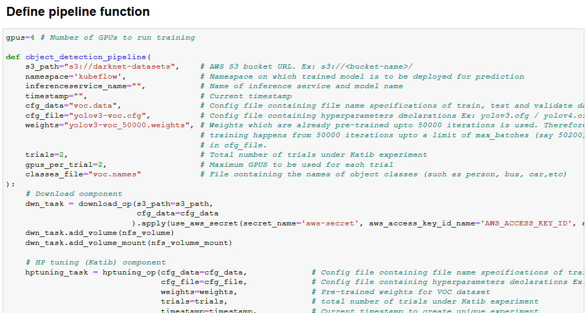
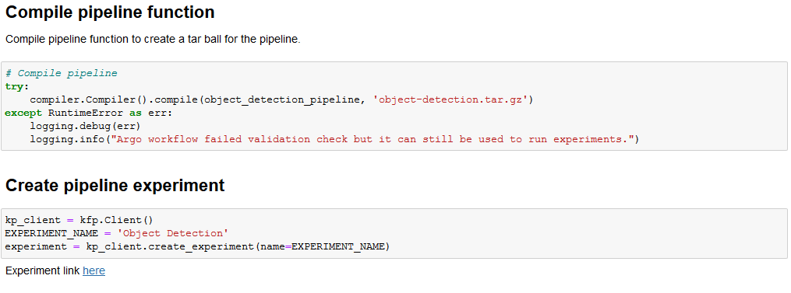
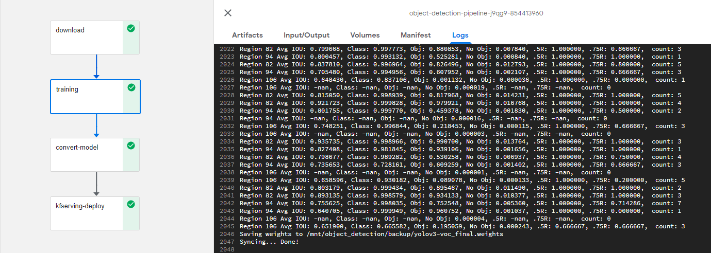
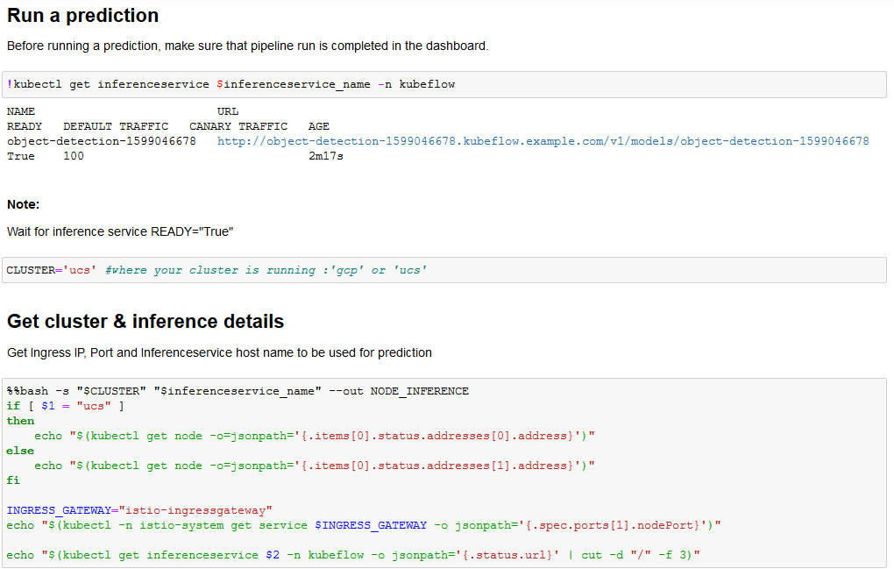
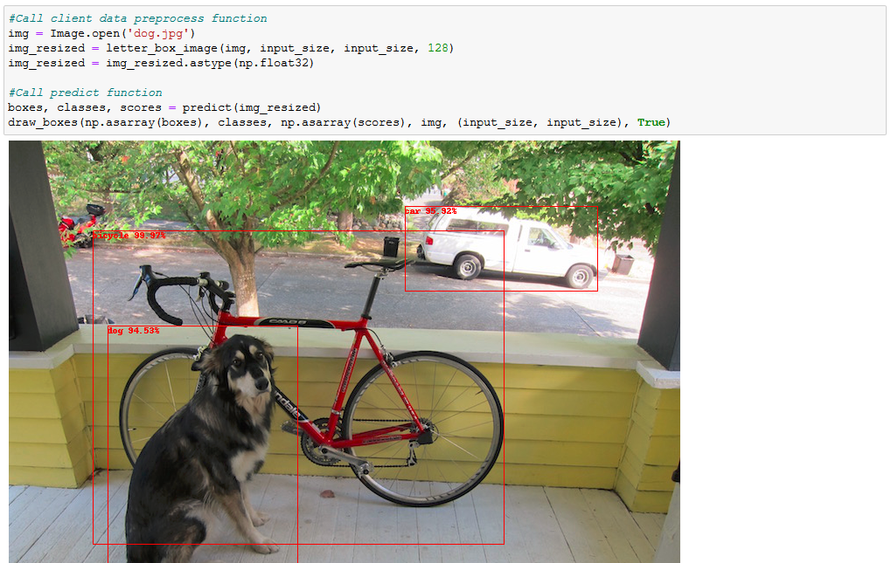

# **Object Detection Workflow using Kubeflow Pipeline**

<!-- vscode-markdown-toc -->
* [Object Detection Workflow](#Workflow)
* [Infrastructure Used](#InfrastructureUsed)
* [Prerequisites](#Prerequisites)
* [S3 Bucket Layout](#AWSSetup)
* [UCS Setup](#UCSSetup)
    * [Install Kubeflow](#InstallKubeflow)
	* [Install NFS server (if not installed)](#InstallNFS)
		* [Retrieve Ingress IP](#RetrieveIngressIP)
		* [Install NFS server, PVs and PVCs](#InstallNFSserverPV)
    * [Create Jupyter Notebook Server](#CreateJupyterNotebookServer)
	* [Create Kubernetes secret](#KubernetesSecret)
	* [Create Label for Kubeflow namespace](#CreateLabel)
	* [Upload Object Detection Pipeline Notebook file](#UploadNotebookfile)
	* [Run Object Detection Pipeline](#RunPipeline)
	* [KF Pipeline Dashboard](#PipelineDashboard)
	* [Model Inference](#Inferencing)
<!-- vscode-markdown-toc-config
	numbering=false
	autoSave=true
	/vscode-markdown-toc-config -->
<!-- /vscode-markdown-toc -->

## <a name='Workflow'></a>**Object Detection Workflow**

* Download datasets, darknet config/weights from object storage.  
* Train an object detection model using darknet.  
* Convert the darknet model/weights to tflite and upload to object storage.  
* Serve tflite model using Kubeflow pipeline.  
* Perform prediction for a client image request through Jupyter-notebook.


## <a name='InfrastructureUsed'></a>**Infrastructure Used**

* Cisco UCS - C240M5 and C480ML

## <a name='Prerequisites'></a>**Prerequisites**

* UCS machine with [Kubeflow](https://www.kubeflow.org/) 1.0 installed
* S3 bucket with read/write permissions

## <a name='AWSSetup'></a>**S3 Bucket Layout**

Ensure that required darknet configuration files ( .cfg & .data ) are in *cfg* directory, dataset files in the *datasets* directory, trained weights files in *pre-trained-weights* directory of the S3 bucket as shown below, for successful training and subsequent inferencing


## <a name='UCSSetup'></a>**UCS Setup**

### <a name='InstallKubeflow'></a>**Install Kubeflow**

To install Kubeflow, follow the instructions from [here](../../../../../install)

### <a name='InstallNFS'></a>**Install NFS server (if not installed)**

To install NFS server follow steps below.

#### <a name='RetrieveIngressIP'></a>*Retrieve Ingress IP*

For installation, we need to know the external IP of the 'istio-ingressgateway' service. This can be retrieved by the following steps.  

```
kubectl get service -n istio-system istio-ingressgateway
```

If your service is of LoadBalancer Type, use the 'EXTERNAL-IP' of this service.  

Or else, if your service is of NodePort Type - run the following command:  

```
kubectl get nodes -o wide
```

Use either of 'EXTERNAL-IP' or 'INTERNAL-IP' of any of the nodes based on which IP is accessible in your network.  

This IP will be referred to as INGRESS_IP from here on.

#### <a name='InstallNFSserverPV'></a>*Install NFS server, PVs and PVCs*

Follow the [steps](./../install/) to install NFS server, PVs and PVCs.


### <a name='CreateJupyterNotebookServer'></a>**Create Jupyter Notebook Server**

Follow the [steps](./../notebook#create--connect-to-jupyter-notebook-server) to create & connect to Jupyter Notebook Server in Kubeflow

### <a name='KubernetesSecret'></a>**Create Kubernetes secret to access S3**

Create secret for AWS_ACCESS_KEY_ID, AWS_SECRET_ACCESS_KEY along with kubeflow deployment with S3 bucket read/write permissions.

It is a one time creation and will be used by dataset download & model conversion components of the pipeline.

Export the AWS credentials

```
 export AWS_ACCESS_KEY_ID = <<Your AWS access key ID>>
 export AWS_SECRET_ACCESS_KEY = <<Your AWS secret access key>>
```
Change access key id and secret access key to base64

```
echo -n $AWS_ACCESS_KEY_ID | base64
<<converted base64 AWS access key id>>

echo -n $AWS_SECRET_ACCESS_KEY | base64
<<converted base64 AWS secret access key>>
```
Create a YAML file (aws-secret.yaml) with the below content & provide base64-converted ID and key in it as shown

```yaml
apiVersion: v1
kind: Secret
metadata:
  name: aws-secret
  namespace: kubeflow
type: Opaque
data:
  AWS_ACCESS_KEY_ID: <<BASE64_CONVERTED_AWS_ACCESS_KEY_ID>>
  AWS_SECRET_ACCESS_KEY: <<BASE64_CONVERTED_AWS_SECRET_ACCESS_KEY>>
```
Create kubernetes secret on UCS by applying the above YAML file

```
kubectl apply -f aws-secret.yaml
```
Verify whether secret is created

```
kubectl get secrets -n kubeflow | grep aws-secret
```

### <a name='CreateLabel'></a>**Create Label for Kubeflow namespace**

A namespace label 'serving.kubeflow.org/inferenceservice=enabled' is set to Kubeflow namespace for inference purpose.

```
kubectl label namespace seldon serving.kubeflow.org/inferenceservice=enabled
```

### <a name='UploadNotebookfile'></a>**Upload Object Detection Pipeline Notebook file**

Upload [object-detection-pipeline-deployment.ipynb](object-detection-pipeline-deployment.ipynb)

### <a name='RunPipeline'></a>**Run Object Detection Pipeline**

Open the Object-Detection-Pipeline-Deployment.ipynb file and start executing cells. 
Notebook screenshots of which is captured below.


## **Note**:

### Build custom inference service image

The serving component of pipeline needs custom inference docker image for inferencing using tflite model.

To [build](./components/v2/model-server) the docker image and push into your Docker Hub. It will be used when adding a new inference server.







*Once the pipeline is executed, a run link will be generated and displayed. 
If you click the link, you will directed to Kubeflow Pipeline Dashboard*

### <a name='PipelineDashboard'></a>**KF Pipeline Dashboard**

Click on the latest experiment which is created


Pipeline components screenshots & logs can be viewed as below




### <a name='Inferencing'></a>**Model Inference**

Create an inference service & check whether it is ready. 
*Note that this will be ready only after the pipeline complete*.






