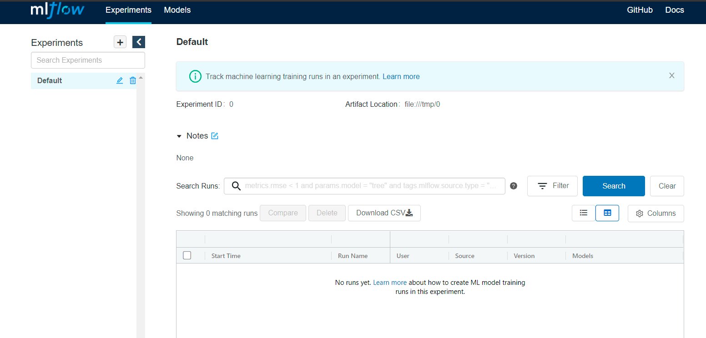
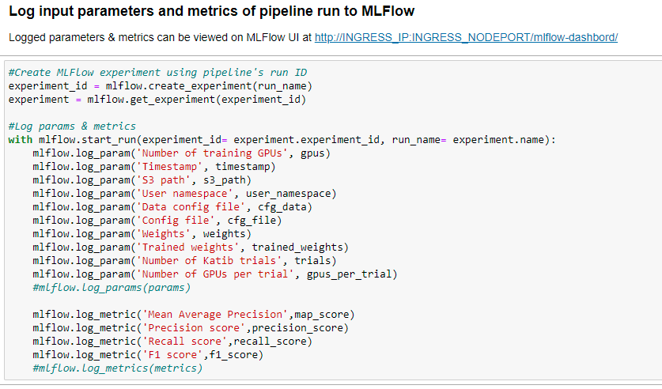
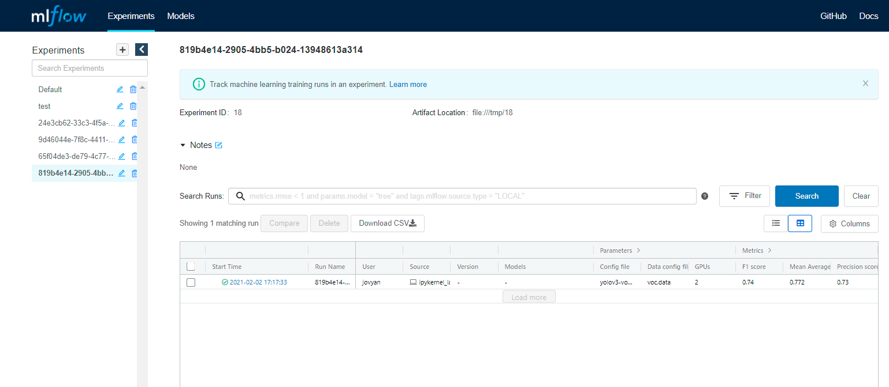
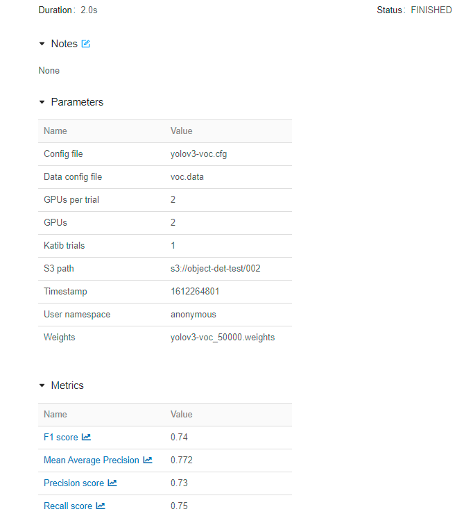

# **Object detection pipeline logging using MLFlow**

<!-- vscode-markdown-toc -->
* [MLFlow](#mlflow)
     * [MLFlow tracking](#mlflowtracking)
          * [MLFlow setup on UCS](#mlflowsetup)
             * [MySQL database setup](#mysqlsetup)
	             * [Create MySQL secret](#mysqlsecret) 
                 * [Create MySQL deployment & service](#createmysqlservice)
	         * [MLFlow tracking server setup](#serversetup)
                 * [Deploy MLFLow tracking server](#deployserver)
          * [MLFlow procedure of use](#mlflowuse)
             * [Log MLFlow runs](#logruns)
             * [Cleanup MLFlow setup on UCS](#cleanupmlflow)
<!-- vscode-markdown-toc-config
	numbering=false
	autoSave=true
	/vscode-markdown-toc-config -->
<!-- /vscode-markdown-toc -->

## <a name='mlflow'></a>**MLFlow**

MLflow is an open source platform for managing end-to-end machine learning lifecycle.

### <a name='mlflowtracking'></a>**MLFlow Tracking**

MLflow tracking component is an API and UI for logging parameters, code versions, metrics, and output files when running your machine learning code and for later visualizing the results.

## <a name='mlflowsetup'></a>**MLFlow setup on UCS**

In order to log the object detection pipeline runs using MLFlow, there is a need to setup MLFlow on UCS before running the pipeline.

The setup steps are as follows:

### <a name='mysqlsetup'></a>***Setup MySQL Database***  

MLflow runs can be recorded to local files, to a SQLAlchemy compatible database, or remotely to a tracking server.
In our case MLflow runs are recorded in MySQL database.

#### <a name='mysqlsecret'></a> **Create Secret for MySQL**

Create a secret using base64 encoding for custom database name, user name and password for your MySQL database similar to [YAML configuration](mysql-secret.yaml), which has base64 encodings for a set of default values listed at the top of manifest file, and apply it to the cluster using the following command. 

```$ kubectl apply -f mysql-secret.yaml -n kubeflow```

```
  Expected Output
  secret/mysqldb-secret created
```

#### <a name='createmysqlservice'></a>**Create MySQL deployment, service & PVC**

The database is deployed to UCS as a Kubernetes deployment using this [YAML configuration](mysql-server-deployment.yaml) using the following command.

```$ kubectl apply -f mysql-server-deployment.yaml -n kubeflow```

```
Expected Output
persistentvolumeclaim/mysql-data-disk created
deployment.apps/mysql-deployment created
service/mysql-service created
```

#### **Check MySQL deployment**

Verify MySQL deployment using the following command.

```$ kubectl get pods -n kubeflow | grep mysql-deployment```

```
Expected Output
mysql-deployment-d9c65fdfd-gdpbx 1/1 Running 0 7m30s
```
### <a name='serversetup'></a>***MLFlow tracking server setup***  

#### <a name='deployserver'></a>**Create MLFlow tracking server deployment & service**

Create a deployment and service for MLFlow tracking server using this [YAML configuration](mlflow_tracking_server.yaml) with the following command.

```$ kubectl apply -f mlflow-tracking-server.yaml -n kubeflow```

```
Expected Output
deployment.apps/mlflow-deployment created
service/mlflow-service created
virtualservice.networking.istio.io/mlflow-virtualsvc created
```

#### **Check MLFlow tracking server deployment & service**

* Verify MLFlow tracking server deployment using the following command.

```$ kubectl get pods -n kubeflow | grep mlflow-deployment```

```
Expected Output
mlflow-deployment-68788c5fb4-cdc88 1/1 Running 0 98m
52s
```
* Verify MLFlow tracking server service using the following command.

```$ kubectl get svc -n kubeflow | grep mlflow-deployment```

```
Expected Output
mlflow-service ClusterIP   10.111.135.88 <none> 80/TCP
```
#### **Access MLFlow Dashboard**

Access MLflow dashboard UI using URL in the following format:

```http://INGRESS_IP:INGRESS_NODEPORT/mlflow-dashboard/```



## <a name='mlflowuse'></a>**MLFlow procedure of use**

Upload, open and start executing [object-detection-pipeline-deployment-mlflow.ipynb](../object-detection-pipeline-deployment-mlflow.ipynb) till ```Pipeline parameters/metrics logging using MLFlow``` cells are reached as shown below.





### <a name='logruns'></a>***Log MLFlow runs***

By executing ```Pipeline parameters/metrics logging using MLFlow``` cells, metrics and/or parameters corresponding to the MLFlow run are logged from the pipeline notebook using MLflow Tracking server URI which looks like:

```http://<mlflow-service-name>.<namespace>.svc.cluster.local:port```




### <a name='cleanupmlflow'></a>**Cleanup MLFlow on UCS**

Delete the MLFlow setup on UCS using the following commands.

* Delete MySQL deployment & service.

```$ kubectl delete -f mlflow_deployment.yaml -n kubeflow```

```
Expected Output
deployment.apps/mlflow-deployment deleted
service/mlflow-service deleted
virtualservice.networking.istio.io "mlflow-virtualsvc" deleted
```

* Delete MLFlow tracking server deployment, service & PVC.

```$ kubectl delete -f mysql-server-deployment.yaml -n kubeflow```

```
Expected Output
persistentvolumeclaim/mysql-data-disk deleted
deployment.apps/mysql-deployment deleted
service/mysql-service deleted
```

* Delete secret for MySQL secret.

```$ kubectl delete -f mysql-secret.yaml -n kubeflow```

```
Expected Output
secret/mysqldb-secret deleted
```
