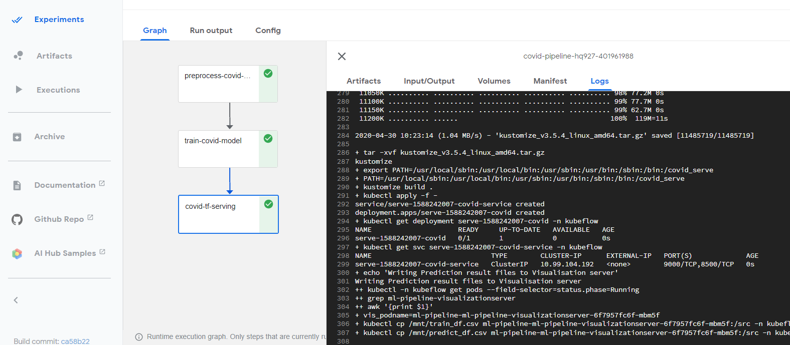
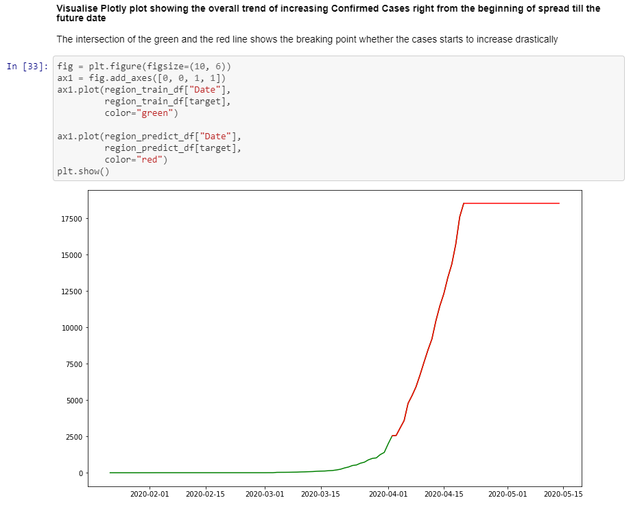

# COVID-19 Forecasting using Kubeflow Pipelines

## What we're going to build

To train, serve a COVID model using Kubeflow Pipeline and get prediction for client request through Jupyter notebook.


## Infrastructure Used

* Cisco UCS - C240M5 and C480ML 

## Setup

### Install NFS server (if not installed)

To install NFS server follow steps below.

#### Retrieve Ingress IP

For installation, we need to know the external IP of the 'istio-ingressgateway' service. This can be retrieved by the following steps.  

```
kubectl get service -n istio-system istio-ingressgateway
```

If your service is of LoadBalancer Type, use the 'EXTERNAL-IP' of this service.  

Or else, if your service is of NodePort Type - run the following command:  

```
kubectl get nodes -o wide
```

Use either of 'EXTERNAL-IP' or 'INTERNAL-IP' of any of the nodes based on which IP is accessible in your network.  

This IP will be referred to as INGRESS_IP from here on.

#### Installing NFS server, PVs and PVCs.

Follow the [steps](./../../../../networking/ble-localization/onprem/install) to install NFS server, PVs and PVCs.

### Create Jupyter Notebook Server

Follow the [steps](https://github.com/CiscoAI/cisco-kubeflow-starter-pack/tree/master/apps/networking/ble-localization/onprem/notebook#create--connect-to-jupyter-notebook-server) to create & connect to Jupyter Notebook Server in Kubeflow

### Upload Notebook file

Upload [COVID-Pipeline-Deployment.ipynb](COVID_Pipeline_Deployment.ipynb)

### Run BLERSSI Pipeline

Open the COVID-Pipeline-Deployment.ipynb file and run pipeline

Clone git repo


Load The Components


Define the COVID Pipeline Function


Once COVID Pipeline is executed, Experiment and Run link will be generated and displayed as output


Click on latest experiment which is created 


Pipeline components execution can be viewed as below.

Logs of COVID Preprocessing Component


Logs of COVID Training Component


Logs of COVID TF Serving Component



Once pipeline execution is completed return to notebook and execute next cell

Pre-process prediction dataset


Make a REST API invocation to serving endpoint for prediction


Post-processing on the prediction


Forecast Table with confirmed Cases


Plot predicted cases in upcoming days



