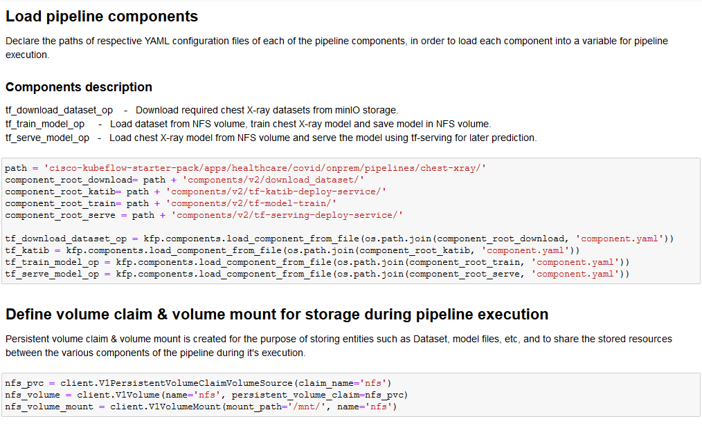
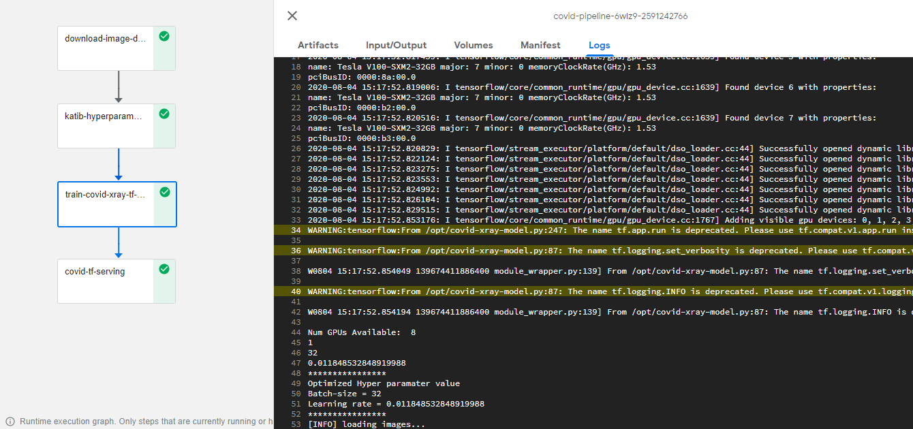
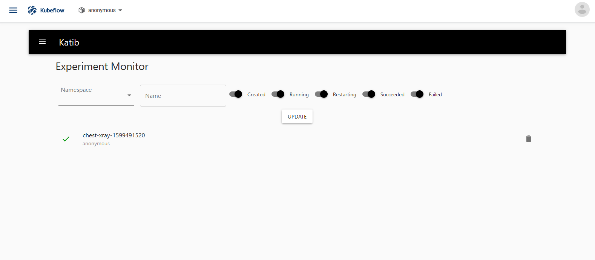
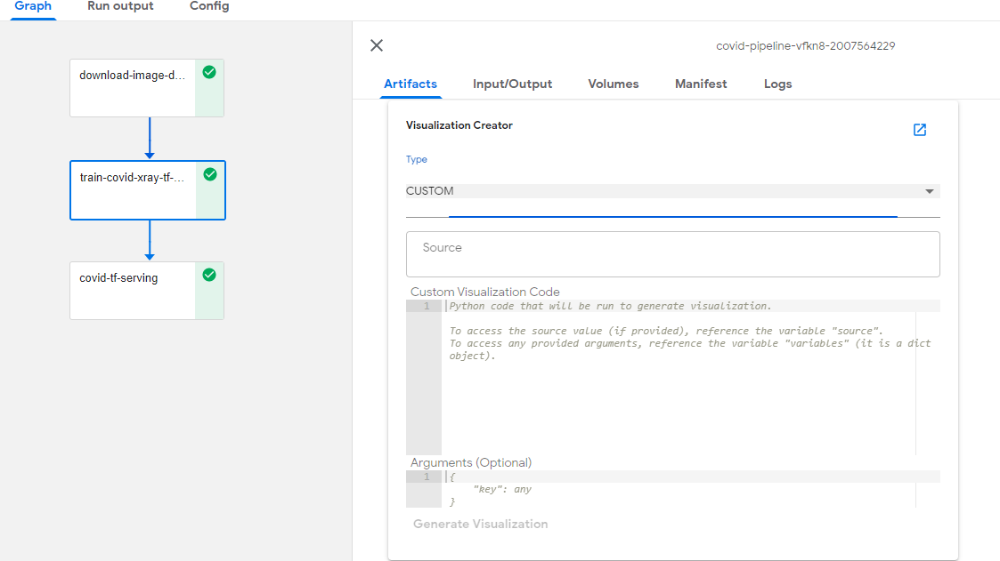
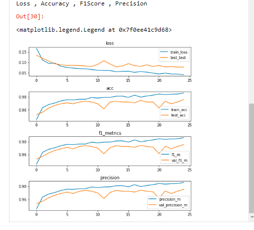

# Chest X-ray Predicton using Kubeflow pipeline

<!-- vscode-markdown-toc -->
* [Chest X-ray Prediction Workflow](#Workflow)
* [Infrastructure Used](#InfrastructureUsed)
* [Prerequisites](#Prerequisites)
* [UCS Setup](#UCSSetup)
    * [Install Kubeflow](#InstallKubeflow)
	* [Install NFS server (if not installed)](#InstallNFS)
		* [Retrieve Ingress IP](#RetrieveIngressIP)
		* [Install NFS server, PVs and PVCs](#InstallNFSserverPV)
* [Chest X-ray Pipeline Notebook](#Notebook)
    * [Create Jupyter notebook server](#CreateJupyterNotebookServer)
    * [Upload Jupyter notebook for chest X-ray pipeline deployment](#UploadPipelinenb)
    * [Run pipeline](#RunPipeline)
    * [KF Pipeline dashboard](#PipelineDashboard)
    * [Katib dashboard](#KatibDashboard)
    * [Model Inference](#Inferencing)
* [Visualizations from Kubeflow Pipeline](#VisualizationfromKFpipeline)
    * [Prerequisites](#visprerequisites)
       * [Add environment variable](#AddEnvVariables)
       * [Add patches](#AddPatches)
       * [Update pipeline visualization image](#UpdatePipelineVisImage)
       * [Install libraries in pipeline visualization pod](#InstallLibraries)
    * [Generate and View Visualizations](#GenerateVis)
<!-- vscode-markdown-toc-config
	numbering=false
	autoSave=true
	/vscode-markdown-toc-config -->
<!-- /vscode-markdown-toc -->

## <a name='Workflow'></a>**Chest X-ray Prediction Workflow**

* Download Chest X-ray datasets from minIO object storage  
* Train Chest X-ray model using Tensorflow
* Serve tensorflow model using Kubeflow pipeline 
* Perform prediction for a client X-ray request through Jupyter notebook


### What we're going to build

Train and serve chest X-ray model using Kubeflow pipeline, and predict X-ray result from Jupyter notebook.


## <a name='InfrastructureUsed'></a>**Infrastructure Used**

* Cisco UCS - C240M5 and C480ML

## <a name='Prerequisites'></a>**Prerequisites**

* UCS machine with [Kubeflow](https://www.kubeflow.org/) 1.0 installed

## <a name='UCSSetup'></a>**UCS Setup**

### <a name='InstallKubeflow'></a>**Install Kubeflow**

To install Kubeflow, follow the instructions from [here](../../../../../install)

### <a name='InstallNFS'></a>**Install NFS server (if not installed)**

To install NFS server follow steps below.

#### <a name='RetrieveIngressIP'></a>***Retrieve Ingress IP***

For installation, we need to know the external IP of the 'istio-ingressgateway' service. This can be retrieved by the following steps.  

```
kubectl get service -n istio-system istio-ingressgateway
```

If your service is of LoadBalancer Type, use the 'EXTERNAL-IP' of this service.  

Or else, if your service is of NodePort Type - run the following command:  

```
kubectl get nodes -o wide
```

Use either of 'EXTERNAL-IP' or 'INTERNAL-IP' of any of the nodes based on which IP is accessible in your network.  

This IP will be referred to as INGRESS_IP from here on.

#### <a name='InstallNFSserverPV'></a>***Install NFS server, PVs and PVCs***

Follow the [steps](./../../../../networking/ble-localization/onprem/install) to install NFS server, PVs and PVCs.

## <a name='Notebook'></a>**Chest X-ray Pipeline Notebook**
### <a name='CreateJupyterNotebookServer'></a>**Create Jupyter notebook server**

Follow the [steps](https://github.com/CiscoAI/cisco-kubeflow-starter-pack/tree/master/apps/networking/ble-localization/onprem/notebook#create--connect-to-jupyter-notebook-server) to create & connect to Jupyter Notebook Server in Kubeflow


### <a name='UploadPipelinenb'></a>**Upload Jupyter notebook for chest X-ray pipeline deployment**

Upload chest-xray-pipeline-deployment.ipynb file from [here](./chest-xray-pipeline-deployment.ipynb)

### <a name='RunPipeline'></a>**Run pipeline**

Open the above uploaded notebook and start executing cells - *git clone, load components, define pipeline* 

O/p screenshots of which are captured below.





Once the above cells are executed, Experiment and Run link will be generated and displayed as output.
If you click Run link, you will be directed to Kubeflow Pipeline Dashboard


### <a name='PipelineDashboard'></a>**KF Pipeline dashboard**

The dashboard lets you navigate through experiments & runs.

Click on latest experiment which is created


Pipeline components screenshots & logs can be viewed as below

Logs of chest X-ray Katib hyperparameter component


Logs of chest X-ray training component


Logs of chest X-ray serving component


### <a name='KatibDashboard'></a>**Katib dashboard**

To track HP tuning created by pipeline, you need to go Katib dashboard from KF Central dashboard's left panel. 

Screenshots of Katib monitor dashboard & Hyperparameter(HP) tuning results are shown below.




### <a name='Inferencing'></a>**Model inference from notebook**

An inference service is created during the serving component execution of the pipeline. Note that inference service will become ready only after the pipeline completes.


## <a name='VisualizationfromKFpipeline'></a>**Visualizations from Kubeflow Pipeline**

Python based visualizations are a new method of generating visualizations within Kubeflow pipelines that allow for rapid development, experimentation, and customization when visualizing results. For information about Python based visualizations and how to use them, please visit the [documentation page](https://www.kubeflow.org/docs/pipelines/sdk/python-based-visualizations).

### <a name='visprerequisites'></a>**Prerequisites**

   - Successful completion of above Kubeflow pipeline  
   
 ### <a name='AddEnvVariables'>**Add environment variable**
   
 If you have not yet deployed Kubeflow pipeline to your cluster, you can edit the frontend deployment YAML file to include the following YAML that specifies that custom visualizations are allowed via environment variables.

        - env:
          - name: ALLOW_CUSTOM_VISUALIZATIONS
            value: true

### <a name='AddPatches'>**Add patches**
 If you already have Kubeflow pipeline deployed within a cluster, you can edit the frontend deployment YAML to specify that custom visualizations are allowed in the same way described above. Details about updating deployments can be found in the Kubernetes documentation about updating a deployment.

        kubectl patch deployment ml-pipeline-ui --patch '{"spec": {"template": {"spec": {"containers": [{"name": "ml-pipeline-ui", "env":[{"name": "ALLOW_CUSTOM_VISUALIZATIONS", "value": "true"}]}]}}}}' -n kubeflow

### <a name='UpdatePipelineVisImage'>**Update pipeline visualization image**
 Update ml-pipeline-visualizationserver deployment with latest docker image

        kubectl patch deployment ml-pipeline-ml-pipeline-visualizationserver --patch '{"spec": {"template": {"spec": {"containers": [{"name": "ml-pipeline-visualizationserver", "image": "gcr.io/ml-pipeline/visualization-server:0.1.35"}]}}}}' -n kubeflow

 ### <a name='InstallLibraries'>**Install libraries in pipeline visualization pod**
 Install required python packages and libraries in ml-pipeline-visualizationserver.

        Usage: kubectl exec -it <<POD-NAME>> -n <<NAMESPACE>> bash
        EX: kubectl exec -it ml-pipeline-ml-pipeline-visualizationserver-6d744dd449-x96cp -n kubeflow bash
        pip3 install matplotlib
        pip3 install pandas
        pip install xlrd==1.0.0

### <a name='GenerateVis'>**Generate and View Visualizations**

Open the details of a run.

Select a component and click on **Artifacts** tab.

Select type as **CUSTOM** from type drop down list.


   
Paste custom visualization code and click on **Generate Visualization**.

                from sklearn.metrics import precision_recall_curve
                from sklearn.metrics import roc_auc_score
                from sklearn.metrics import roc_curve
                import matplotlib.pyplot as plt
                import numpy as np
                import pandas as pd

                rd = pd.read_excel('xray_source.xlsx',index=None,sheet_name='Sheet2')
                rc = pd.read_excel('xray_source.xlsx',index=None,sheet_name='Sheet1')

                #ROC
                print("sklearn ROC AUC Score:")
                fpr, tpr, _ = roc_curve(np.array(rc['actual']),np.array(rc['pred']))
                plt.figure()
                plt.plot(fpr, tpr, color='darkorange',
                         lw=2, label='ROC curve')
                plt.plot([0, 1], [0, 1], color='navy', lw=2, linestyle='--') #center line
                plt.xlim([0.0, 1.0])
                plt.ylim([0.0, 1.05])
                plt.xlabel('False Positive Rate')
                plt.ylabel('True Positive Rate')
                plt.title('Receiver operating characteristic example')
                plt.legend(loc="lower right")
                plt.show()

                print("Precision-Recall Curve:")
                precision, recall, _ = precision_recall_curve(np.array(rc['actual']),np.array(rc['pred']))
                plt.step(recall, precision, color='g', alpha=0.2, where='post')
                plt.fill_between(recall, precision, alpha=0.2, color='g', step='post')
                plt.xlabel('Recall')
                plt.ylabel('Precision')
                plt.ylim([0.0, 1.0])
                plt.xlim([0.0, 1.0])
                plt.title('Precision-Recall curve')
                plt.show()

                print("Loss , Accuracy , F1Score , Precision")
                fig, (ax1, ax2, ax3, ax4) = plt.subplots(4,figsize=(7,7))
                # fig, ((ax1, ax2), (ax3, ax4)) = plt.subplots(2, 2)
                ax1.plot(rd['loss'], label='train_loss')
                ax1.plot(rd['val_loss'], label='test_test')
                ax1.set_title('loss')
                ax1.legend()

                fig.tight_layout(pad=1.0)
                ax2.plot(rd['acc'], label='train_acc')
                ax2.plot(rd['val_acc'], label='test_acc')
                ax2.set_title('acc')
                ax2.legend()

                fig.tight_layout(pad=1.0)
                ax3.plot(rd['f1_m'], label='f1_m')
                ax3.plot(rd['val_f1_m'], label='val_f1_m')
                ax3.set_title('f1_metrics')
                ax3.legend()

                fig.tight_layout(pad=1.0)
                ax4.plot(rd['precision_m'], label='precision_m')
                ax4.plot(rd['val_precision_m'], label='val_precision_m')
                ax4.set_title('precision')
                ax4.legend()
                
View generated visualization by scrolling down.

   
   
   

## **Note**:

### How to gather dataset from various sources before pipeline execution

To download & generate image dataset from various sources and store it in Kubeflow minIO object storage (from which datasets are downloaded during pipeline execution), upload dataset-builder-minio-store.ipynb file from [here](./dataset-builder-minio-store.ipynb) to your working directory and execute the notebook only once.
