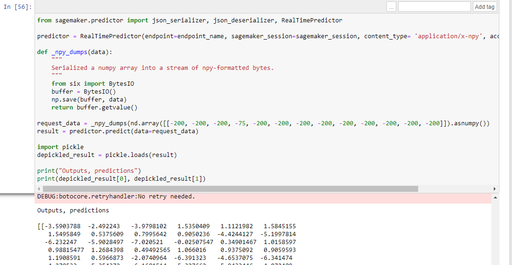

# BLERSSI Hybrid Pipeline 

# Cisco UCS 🤝 SageMaker

## Pre-requisites

- [ ] UCS machine with Kubeflow installed
- [ ] AWS account with appropriate permissions

## AWS S3 Create Bucket

Ensure you have the AWS CLI installed. 
Otherwise, you can use the docker image with the alias set.

    alias aws='docker run --rm -it -v ~/.aws:/root/.aws -v $(pwd):/aws amazon/aws-cli'
    aws s3 mb s3://mxnet-model-store --region us-west-2

## SageMaker permissions

In order to run this pipeline, we need to prepare an IAM Role to run Sagemaker jobs. You need this `role_arn` to run a pipeline. Check [here](https://docs.aws.amazon.com/sagemaker/latest/dg/sagemaker-roles.html) for details.

This pipeline also use aws-secret to get access to Sagemaker services, please also make sure you have a `aws-secret` in the kubeflow namespace.

    echo -n $AWS_ACCESS_KEY_ID | base64
    echo -n $AWS_SECRET_ACCESS_KEY | base64

```yaml
apiVersion: v1
kind: Secret
metadata:
  name: aws-secret
  namespace: kubeflow
type: Opaque
data:
  AWS_ACCESS_KEY_ID: YOUR_BASE64_ACCESS_KEY
  AWS_SECRET_ACCESS_KEY: YOUR_BASE64_SECRET_ACCESS
```

## Run notebook to create pipeline

Ensure you have jupyter lab installed on your local machine. And Kubeflow installed 

    git clone https://github.com/CiscoAI/cisco-kubeflow-starter-pack cksp
    cd cksp
    cd apps/networking/ble-localization/hybrid-aws/pipelines/
    
    
### Upload Notebook file

Upload [blerssi-aws.ipynb](blerssi-aws.ipynb) file in jupyter notebook
    
### Run Pipeline

Open the [blerssi-aws.ipynb](blerssi-aws.ipynb) file and run pipeline

Set the input parameters for the pipeline in the first cell of the notebook.


Import libraries and declare variables(model and deploy)


Define BLERSSI mxnet pipeline function


Create kubeflow experiment with name "BLERSSI-Sagemaker"


### Note :

  Inorder to create the sagemaker endpoint, create inference image push to ecr repo. follow the below steps
    
  1. Create docker image from [this](./components/v1/mxnet-byom-inference/container/) location
  2. push docker image to ecr repository.	 click [here](https://docs.aws.amazon.com/AmazonECR/latest/userguide/docker-push-ecr-image.html) for details

Set AWS region and inference image parameters


Create BLERSSI run and open run link


The BLERSSI Sagemaker pipeline starts execting. 
Once all the components executed successfully, check the logs of sagemaker-deploy component to verify endpoint is created.


To verify endpoint in AWS, open AWS sagemaker and check endpoints created succussfully as snapshot given below


### Run Prediction API

To predict the output go back to jupyter notebook and start executing other cells

Provide AWS credentials


Predicted result will be displayed


