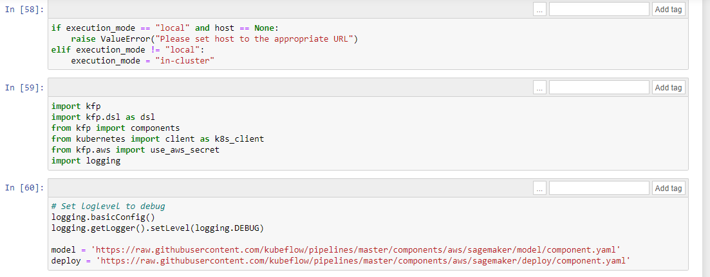
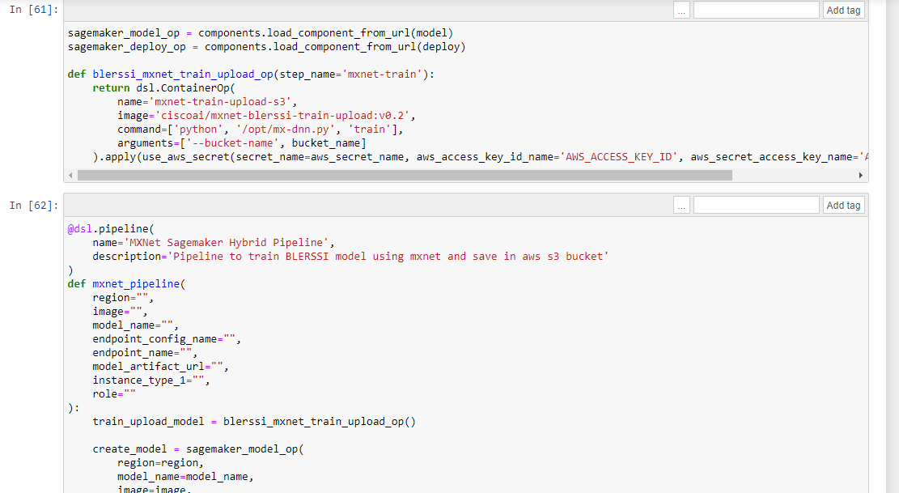
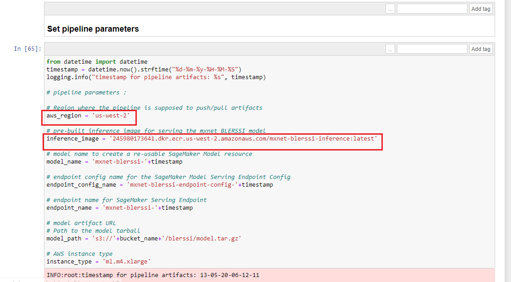
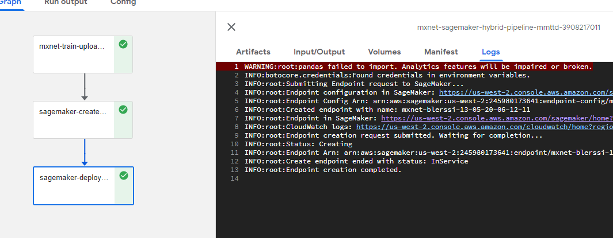
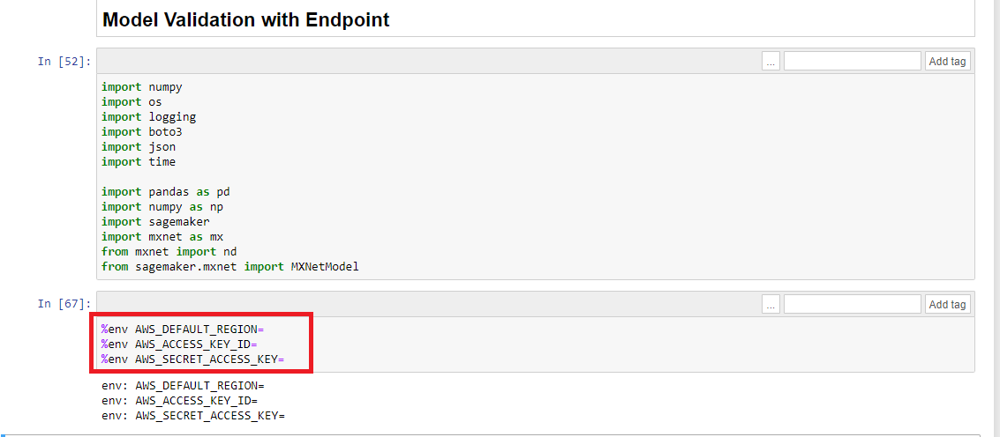

# BLE-RSSI Hybrid Pipeline using Cisco UCS 🤝 Amazon SageMaker

<!-- vscode-markdown-toc -->
* [Prerequisites](#Prerequisites)
* [AWS Setup](#AWSSetup)
	* [Create S3 Bucket](#CreateS3Bucket)
	* [Setup SageMaker permissions](#SetupSageMakerpermissions)
* [UCS Setup](#UCSSetup)
	* [Retrieve Ingress IP](#RetrieveIngressIP)
* [Pipeline Workflow](#PipelineWorkflow)
	* [Create Jupyter Notebook Server](#CreateJupyterNotebookServer)
	* [Upload Hybrid Pipeline notebook](#UploadHybridPipelinenotebook)
	* [Run Pipeline](#RunPipeline)
	* [Note - Building inference image](#Note-Buildinginferenceimage)
	* [Run Prediction API](#RunPredictionAPI)

<!-- vscode-markdown-toc-config
	numbering=false
	autoSave=true
	/vscode-markdown-toc-config -->
<!-- /vscode-markdown-toc -->

## <a name='Prerequisites'></a>Prerequisites

- [ ] UCS machine with Kubeflow 1.0 installed
- [ ] AWS account with appropriate permissions

## <a name='AWSSetup'></a>AWS Setup
### <a name='CreateS3Bucket'></a>Create S3 Bucket

Ensure you have the AWS CLI installed. 
Otherwise, you can use the docker image with the alias set.

    alias aws='docker run --rm -it -v ~/.aws:/root/.aws -v $(pwd):/aws amazon/aws-cli'
    aws s3 mb s3://mxnet-model-store --region us-west-2

### <a name='SetupSageMakerpermissions'></a>Setup SageMaker permissions

In order to run this pipeline, we need to prepare an IAM Role to run Sagemaker jobs. You need this `role_arn` to run a pipeline. Check [here](https://docs.aws.amazon.com/sagemaker/latest/dg/sagemaker-roles.html) for details.

Attach AmazonS3FullAccess and AmazonSageMakerFullAccess policies with IAM Role.


This pipeline also use aws-secret to get access to Sagemaker services, please also make sure you have a `aws-secret` in the kubeflow namespace.

    echo -n $AWS_ACCESS_KEY_ID | base64
    echo -n $AWS_SECRET_ACCESS_KEY | base64

```yaml
apiVersion: v1
kind: Secret
metadata:
  name: aws-secret
  namespace: kubeflow
type: Opaque
data:
  AWS_ACCESS_KEY_ID: YOUR_BASE64_ACCESS_KEY
  AWS_SECRET_ACCESS_KEY: YOUR_BASE64_SECRET_ACCESS
```

## <a name='UCSSetup'></a>UCS Setup

To install Kubeflow, follow the instructions [here](../../../../../install)

### <a name='RetrieveIngressIP'></a>Retrieve Ingress IP

For installation, we need to know the external IP of the 'istio-ingressgateway' service. This can be retrieved by the following steps.  

```
kubectl get service -n istio-system istio-ingressgateway
```

If your service is of LoadBalancer Type, use the 'EXTERNAL-IP' of this service.  

Or else, if your service is of NodePort Type - run the following command:  

```
kubectl get nodes -o wide
```

Use either of 'EXTERNAL-IP' or 'INTERNAL-IP' of any of the nodes based on which IP is accessible in your network.  

This IP will be referred to as INGRESS_IP from here on.

## <a name='PipelineWorkflow'></a>Pipeline Workflow
Once the setup is complete, the following are the steps in the pipeline
workflow.

### <a name='CreateJupyterNotebookServer'></a>Create Jupyter Notebook Server

Follow the [steps](./../notebook#create--connect-to-jupyter-notebook-server) to create & connect to Jupyter Notebook Server in Kubeflow    
    
### <a name='UploadHybridPipelinenotebook'></a>Upload Hybrid Pipeline notebook

Upload [blerssi-aws.ipynb](blerssi-aws.ipynb) file to the created Notebook server.
    
### <a name='RunPipeline'></a>Run Pipeline

Open the [blerssi-aws.ipynb](blerssi-aws.ipynb) file and run pipeline

Set the input parameters for the pipeline in the first cell of the notebook.


Import libraries and set model/deploy component yaml path variables.



Define BLERSSI mxnet pipeline function



Create experiment with name "BLERSSI-Sagemaker"


### <a name='Note-Buildinginferenceimage'></a>Note - Building inference image
   Run build & push script [here](./components/v1/mxnet-byom-inference/container/build_and_push.sh) using your *account credentials*.

Set AWS region, and inference image to the built ECR image



Create BLERSSI run and open run link


The BLERSSI Sagemaker pipeline starts executing. 
Once all the components executed successfully, check the logs of sagemaker-deploy component to verify endpoint is created.



To verify endpoint in AWS, open AWS sagemaker and check endpoints created successfully as snapshot given below


### <a name='RunPredictionAPI'></a>Run Prediction API

To predict the output go back to jupyter notebook and start executing other cells

Provide AWS credentials



Predicted result will be displayed


