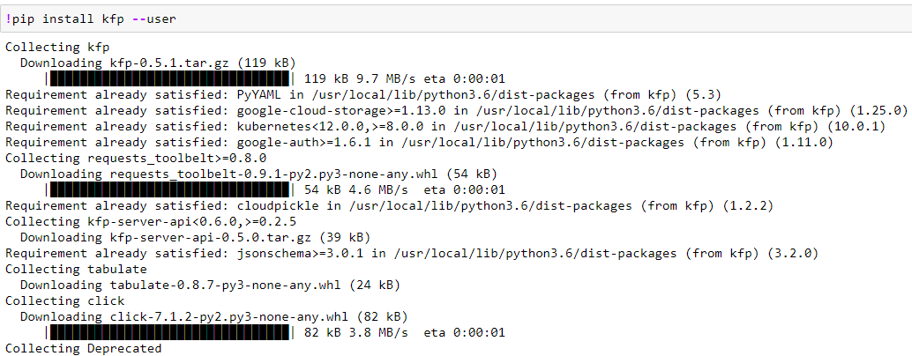
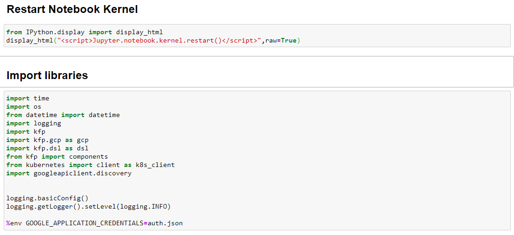

# BLE-RSSI Hybrid Pipeline using Cisco UCS 🤝 GCP Al platform

<!-- vscode-markdown-toc -->
* [Problem Definition](#ProblemDefinition)
* [Prerequisites](#Prerequisites)
* [GCP Setup](#GCPSetup)
	* [Authorizing Gcloud](#AuthorizingGcloud)
	* [Create Gcp Secret](#CreateGcpSecret)
* [UCS Setup](#UCSSetup)
	* [Retrieve Ingress IP](#RetrieveIngressIP)
* [Pipeline Workflow](#PipelineWorkflow)
	* [Create Jupyter Notebook Server](#CreateJupyterNotebookServer)
	* [Upload Hybrid Pipeline notebook](#UploadHybridPipelinenotebook)
	* [Run Pipeline](#RunPipeline)
	* [Run Prediction API](#RunPredictionAPI)
	* [Clean Up](#CleanUp)

<!-- vscode-markdown-toc-config
	numbering=false
	autoSave=true
	/vscode-markdown-toc-config -->
<!-- /vscode-markdown-toc -->

## <a name='ProblemDefinition'></a>Problem Definition
The description of the BLE-RSSI based location prediction problem
can be found [here](../../README.md).

## <a name='Prerequisites'></a>Prerequisites

- [ ] UCS machine with Kubeflow 1.0 installed
- [ ] GCP account with appropriate permissions


The overall solution uses [Kubeflow](https://www.kubeflow.org/) to run
the training on [Cisco UCS](https://www.cisco.com/c/en_in/products/servers-unified-computing/index.html) servers and the model is then served via [GCP Al platform](https://cloud.google.com/ai-platform/prediction/docs).

## <a name='GCPSetup'></a>GCP Setup
### <a name='AuthorizingGcloud'></a>Authorizing Gcloud

To authorize gcloud to access Google Cloud Platform using an existing service account while also specifying a project


### <a name='CreateGcpSecret'></a>Create Gcp Secret

Pipeline uses user-gcp-sa to get access to GCS and Al platform resources

Make sure you have `user-gcp-sa` in kubeflow namespace.

```
kubectl create secret generic user-gcp-sa -n kubeflow --from-file=user-gcp-sa.json=auth.json
kubectl get secret -n kubeflow | grep user-gcp-sa
```


## <a name='UCSSetup'></a>UCS Setup

To install Kubeflow, follow the instructions [here](../../../../../install)

### <a name='RetrieveIngressIP'></a>Retrieve Ingress IP

For installation, we need to know the external IP of the 'istio-ingressgateway' service. This can be retrieved by the following steps.  

```
kubectl get service -n istio-system istio-ingressgateway
```

If your service is of LoadBalancer Type, use the 'EXTERNAL-IP' of this service.  

Or else, if your service is of NodePort Type - run the following command:  

```
kubectl get nodes -o wide
```

Use either of 'EXTERNAL-IP' or 'INTERNAL-IP' of any of the nodes based on which IP is accessible in your network.  

This IP will be referred to as INGRESS_IP from here on.

## <a name='PipelineWorkflow'></a>Pipeline Workflow
Once the setup is complete, the following are the steps in the pipeline
workflow.

### <a name='CreateJupyterNotebookServer'></a>Create Jupyter Notebook Server

Follow the [steps](./../notebook#create--connect-to-jupyter-notebook-server) to create & connect to Jupyter Notebook Server in Kubeflow    
### <a name='UploadHybridPipelinenotebook'></a>Upload Hybrid Pipeline notebook

Upload [blerssi-gcp.ipynb](blerssi-gcp.ipynb) and gcp service account(Rename it as auth.json) files to the created Notebook server.
    
### <a name='RunPipeline'></a>Run Pipeline

Open the [blerssi-gcp.ipynb](blerssi-gcp.ipynb) file and run pipeline

Install required libraries



Restart kernel and Import libraries 



Set other pipeline parameters


Set deploy component yaml path variables.


Define BLERSSI pipeline function


Create experiment with name "BLERSSI-GCP"


Create BLERSSI run and open run link


The BLERSSI GCP pipeline starts executing. 
Once all the components executed successfully, check the logs of deploying-a-trained-model component to verify state is Read.


To verify endpoint in GCP, open GCP Al platform and check endpoints created successfully as snapshot given below


### <a name='RunPredictionAPI'></a>Run Prediction API

To predict the output go back to jupyter notebook and start executing other cells

Predicted result will be displayed


### <a name='CleanUp'></a>Clean Up

To clean up all GCP resources used in this Notebook


