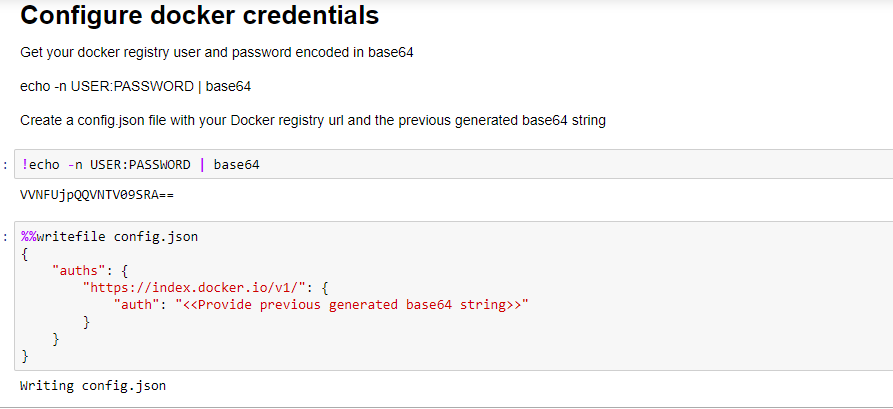
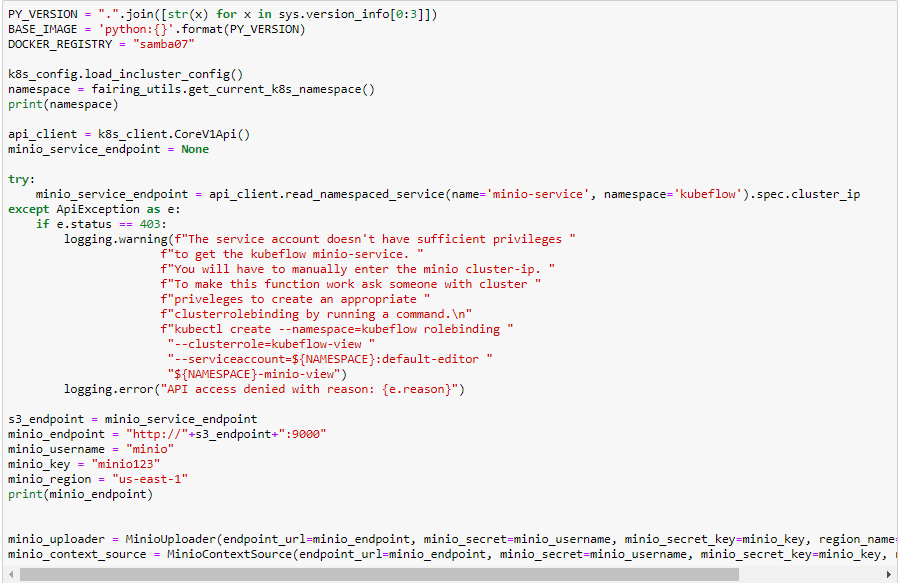

# BLERSSI Location Prediction using Kubeflow Fairing 

## What we're going to build

Train & save a BLERSSI location model using kubeflow fairing from jupyter notebook. Then, deploy the trained model to Kubeflow for Predictions.


## Infrastructure Used

* Cisco UCS - C240


## Setup


### Install NFS server (if not installed)

To install NFS server follow steps below.

#### Retrieve Ingress IP

For installation, we need to know the external IP of the 'istio-ingressgateway' service. This can be retrieved by the following steps.  

```
kubectl get service -n istio-system istio-ingressgateway
```

If your service is of LoadBalancer Type, use the 'EXTERNAL-IP' of this service.  

Or else, if your service is of NodePort Type - run the following command:  

```
kubectl get nodes -o wide
```

Use either of 'EXTERNAL-IP' or 'INTERNAL-IP' of any of the nodes based on which IP is accessible in your network.  

This IP will be referred to as INGRESS_IP from here on.

#### Installing NFS server, PVs and PVCs.

Follow the [steps](./../install/) to install NFS server, PVs and PVCs.

### Create Jupyter Notebook Server

Follow the [steps](./../notebook#create--connect-to-jupyter-notebook-server) to create & connect to Jupyter Notebook Server in Kubeflow

### Upload Notebook, Dockerfile and blerssi-model files

Upload [BLERSSI-Classification-fairing.ipynb](BLERSSI-Classification-fairing.ipynb), [Dockerfile](Dockerfile) and [blerssi-model.py](blerssi-model.py) to notebook serv
er.


### Run BLERSSI Notebook

Open the BLERSSI-Classification-fairing.ipynb file and run notebook

#### Configure docker credentials



#### Create requirements.txt with require python packages


#### Import Libraries


#### Get minio-service cluster IP to upload docker build context

Note: The DOCKER_REGISTRY variable is used to push the newly built image. Please change the variable to the registry for which you've configured credentials.



#### Create a config-map in the namespace you're using with the docker config

Note: create configmap only with the name "docker-config". If already exists, delete existing one and create new configmap.

Delete existing configmap

```
kubectl delete configmap -n $namespace docker-config
```


#### Build docker image for our model


#### Define TFJob Class to create training job


#### Define Blerssi class to be used by Kubeflow fairing

Note: Must necessarily contain train() and predict() methods


#### Train an Blerssi model remotely on Kubeflow

Kubeflow Fairing packages the BlerssiServe class, the training data, and the training job's software prerequisites as a Docker image. Then Kubeflow Fairing deploys and runs the training job on kubeflow.


#### Deploy the trained model to Kubeflow for predictions

Kubeflow Fairing packages the BlerssiServe class, the trained model, and the prediction endpoint's software prerequisites as a Docker image. Then Kubeflow Fairing deploys and runs the prediction endpoint on Kubeflow.


#### Get prediction endpoint


#### Predict location for data using prediction endpoint

Change endpoint in the curl command to your provided value before executing location prediction.


#### Clean up the prediction endpoint
Delete the prediction endpoint created by this notebook.


