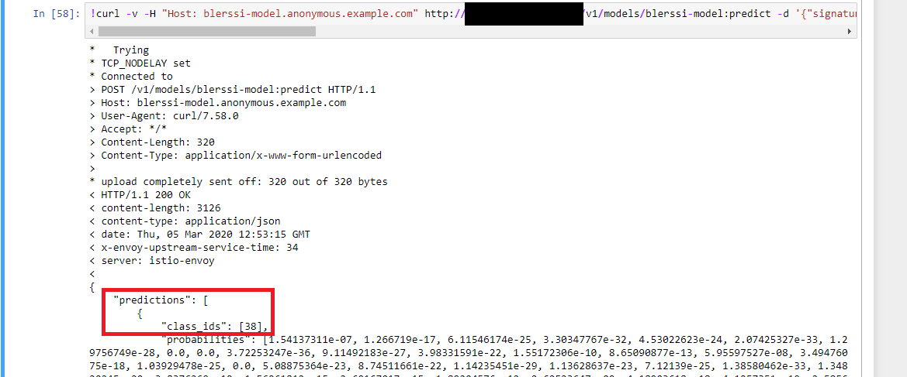

# BLERSSI Location Prediction 

<!-- vscode-markdown-toc -->
* [What we're going to do](#Whatweregoingtodo)
	* [Infrastructure Used](#InfrastructureUsed)
* [Setup](#Setup)
	* [Install NFS server (if not installed)](#InstallNFSserverifnotinstalled)
		* [Retrieve Ingress IP](#RetrieveIngressIP)
		* [Installing NFS server, PVs and PVCs.](#InstallingNFSserverPVsandPVCs.)
	* [Create & Connect to Jupyter Notebook Server](#CreateConnecttoJupyterNotebookServer)
	* [Upload Notebook, Data & Yaml files](#UploadNotebookDataYamlfiles)
	* [Train BLERSSI Model](#TrainBLERSSIModel)
	* [Serve BLERSSI Model from Kubernetes PVC through Kubeflow Kfserving](#ServeBLERSSIModelfromKubernetesPVCthroughKubeflowKfserving)
	* [Predict location for test data using served BLERSSI Model](#PredictlocationfortestdatausingservedBLERSSIModel)

<!-- vscode-markdown-toc-config
	numbering=false
	autoSave=true
	/vscode-markdown-toc-config -->
<!-- /vscode-markdown-toc -->


## <a name='Whatweregoingtodo'></a>What we're going to do

Train & save a BLERSSI location model from kubeflow jupyter notebook.
Then, serve and predict using the saved model.

### <a name='InfrastructureUsed'></a>Infrastructure Used

* Cisco UCS - C240

## <a name='Setup'></a>Setup

### <a name='InstallNFSserverifnotinstalled'></a>Install NFS server (if not installed)

To install NFS server follow steps below.

#### <a name='RetrieveIngressIP'></a>Retrieve Ingress IP

For installation, we need to know the external IP of the 'istio-ingressgateway' service. This can be retrieved by the following steps.

```
kubectl get service -n istio-system istio-ingressgateway
```

If your service is of LoadBalancer Type, use the 'EXTERNAL-IP' of this service.

Or else, if your service is of NodePort Type - run the following command:

```
kubectl get nodes -o wide
```

Use either of 'EXTERNAL-IP' or 'INTERNAL-IP' of any of the nodes based on which IP is accessible in your network.

This IP will be referred to as INGRESS_IP from here on.

#### <a name='InstallingNFSserverPVsandPVCs.'></a>Installing NFS server, PVs and PVCs.

Follow the [steps](./../install/) to install NFS server, PVs and PVCs.

### <a name='CreateConnecttoJupyterNotebookServer'></a>Create & Connect to Jupyter Notebook Server

You can access Kubeflow Dashboard using the Ingress IP, provided while running [nfs-installation](./../install#-provide-ucs-cluster-ip) script, and _31380_ port. For example, http://<INGRESS_IP:31380>

Select _anonymous_ namespace and click Notebook Servers in the left panel of the Kubeflow Dashboard


Click New Server button and provide required details 


Provide Notebook Server name, custom Docker Image URL or use prebuilt Image, _samba07/pipeline-notebook:v0.1_ , in the Image Tab


Set Workspace Volume type as _None_.


Click Add Volume under Data Volume; Set type to _existing_ and name to _nfs1_ with mount point as /mnt/


Click LAUNCH Button


Once the Notebook Server is created, click on connect button.


### <a name='UploadNotebookDataYamlfiles'></a>Upload Notebook, Data & Yaml files

Upload the [BLERSSI-Classification.ipynb](./BLERSSI-Classification.ipynb), [iBeacon_RSSI_Labeled.csv](./../data/iBeacon_RSSI_Labeled.csv) and [blerssi_kfserving.yaml](./blerssi_kfserving.yaml) to the Notebook Server.


### <a name='TrainBLERSSIModel'></a>Train BLERSSI Model

Open the BLERSSI-Classification.ipynb file and run first command to train BLERSSI model


Once training completes, the model will be stored in local notebook server


### <a name='ServeBLERSSIModelfromKubernetesPVCthroughKubeflowKfserving'></a>Serve BLERSSI Model from Kubernetes PVC through Kubeflow Kfserving


### <a name='PredictlocationfortestdatausingservedBLERSSIModel'></a>Predict location for test data using served BLERSSI Model 

Change Ingress IP in the curl command to your provided value before executing location prediction.




Prediction - class_ids(38) in response is location and predicted using kubeflow-kfserving which represents the location "M05"

