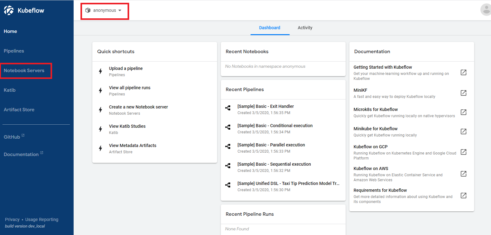
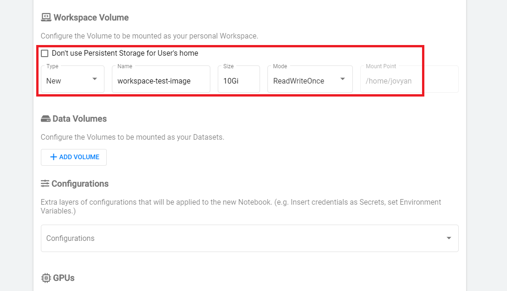

# BLERSSI Location Prediction 

## What we're going to do

Train & save a BLERSSI location model from kubeflow jupyter notebook.
Then, serve and predict using the saved model.

### Infrastructure Used

* Cisco UCS - C240M5 and C480ML

## Setup

### Retrieve Ingress IP

We need to know the external IP of the 'istio-ingressgateway' service. This can be retrieved by the following steps.

```
kubectl get service -n istio-system istio-ingressgateway
```

If your service is of LoadBalancer Type, use the 'EXTERNAL-IP' of this service.

Or else, if your service is of NodePort Type - run the following command:

```
kubectl get nodes -o wide
```

Use either of 'EXTERNAL-IP' or 'INTERNAL-IP' of any of the nodes based on which IP is accessible in your network.

This IP will be referred to as INGRESS_IP from here on.

### Create & Connect to Jupyter Notebook Server

You can access Kubeflow Dashboard using the Ingress IP, and _31380_ port. For example, http://<INGRESS_IP:31380>

Select _anonymous_ namespace and click Notebook Servers in the left panel of the Kubeflow Dashboard




Click New Server button and provide required details 


Provide Notebook Server name and select notebook image appropriately as below
     
     CPU  - gcr.io/kubeflow-images-public/tensorflow-1.15.2-notebook-cpu:1.0.0
     GPU  - gcr.io/kubeflow-images-public/tensorflow-1.15.2-notebook-gpu:1.0.0


Create new Workspace Volume



If you are creating GPU attached notebook then choose number of GPUs and GPU Vendor as *NVIDIA*. 

Click Launch Button


Once Notebook Server is created, click on Connect button.


### Upload Notebook, Data & Yaml files

Upload the [BLERSSI-Classification.ipynb](./BLERSSI-Classification.ipynb), [iBeacon_RSSI_Labeled.csv](./../data/iBeacon_RSSI_Labeled.csv) and [blerssi_kfserving.yaml](./blerssi_kfserving.yaml) to the Notebook Server.


### Train BLERSSI Model

Open the notebook file and run first command to train BLERSSI model


Once training completes, the model will be stored in local notebook server


### Serve BLERSSI Model from K8s PVC through Kfserving


### Predict location for test data using served BLERSSI Model 

Change Ingress IP in the curl command to your provided value before executing location prediction.


Prediction - class_ids(38) in response is location and predicted using kubeflow-kfserving which represents the location "M05"


