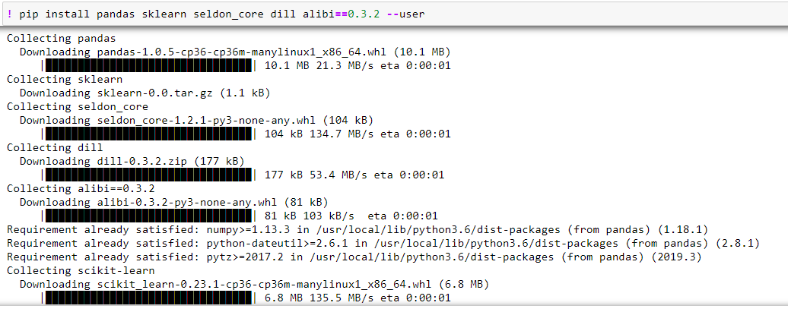
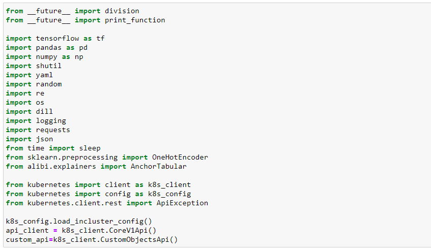
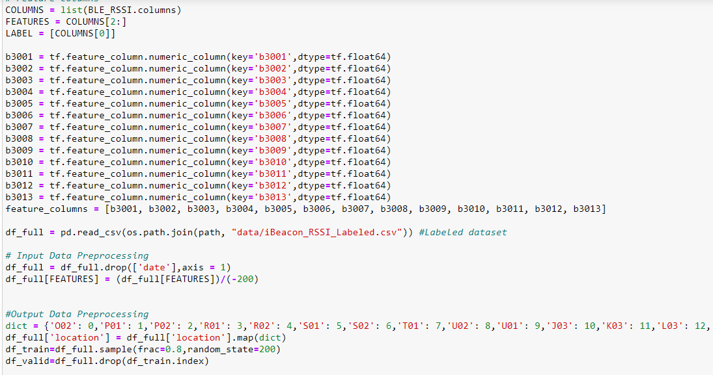
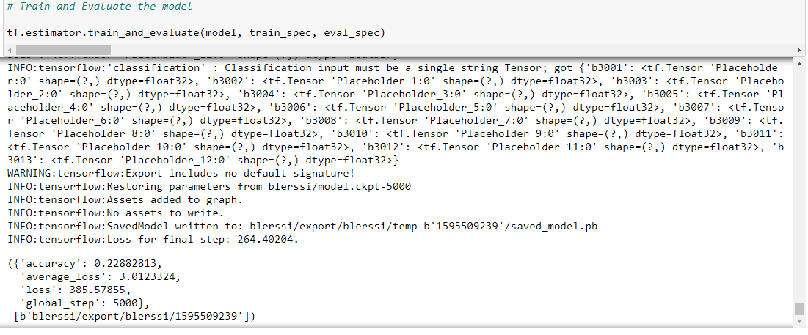
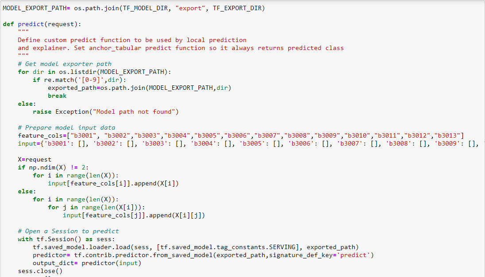
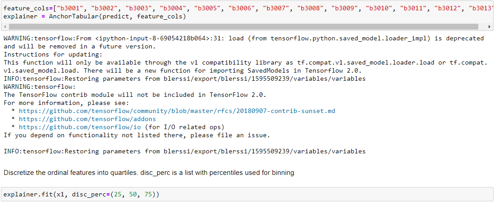
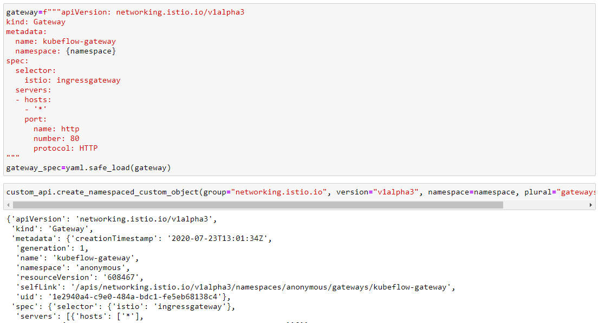
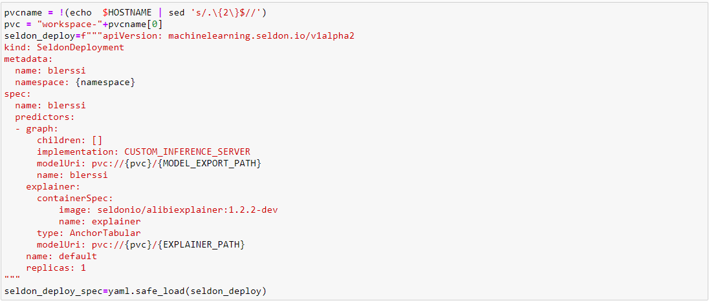
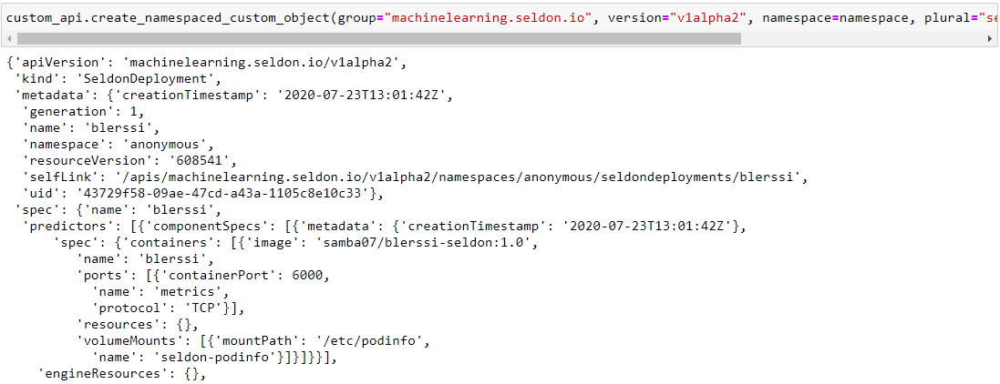
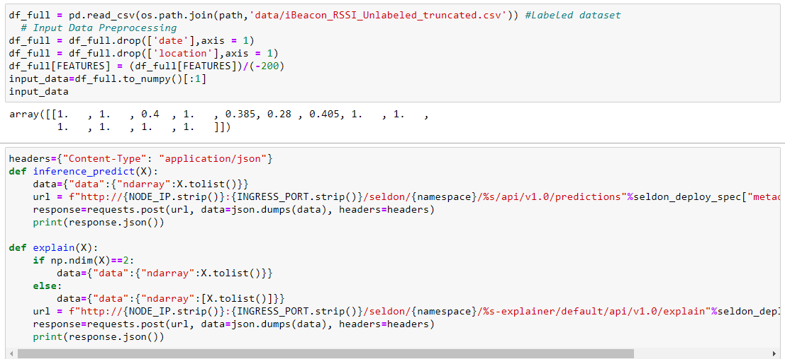

# Seldon Serving and Explainer for BLERSSI Location Prediction

<!-- vscode-markdown-toc -->
* [What we're going to build](#Whatweregoingtobuild)
    * [Infrastructure Used](#InfrastructureUsed)
* [Prerequisites](#Prerequisites)
    * [Update Seldon Core Operator Crds](#UpdateSeldonCoreOperatorCrds)
* [UCS Setup](#UCSSetup)
    * [Retrieve Ingress IP](#RetrieveIngressIP)
* [Notebook Workflow](#NotebookWorkflow)
    * [Create Jupyter Notebook Server](#CreateJupyterNotebookServer)
    * [Upload Notebook](#UploadNotebook)
    * [Run Notebook](#RunNotebook)
* [CleanUp](#CleanUp)

<!-- vscode-markdown-toc-config
        numbering=false
        autoSave=true
        /vscode-markdown-toc-config -->
<!-- /vscode-markdown-toc -->

## <a name='Whatweregoingtobuild'></a>What we're going to build

Train & save a BLERSSI location model from Kubeflow Jupyter notebook. Then, serve and predict using the saved model and explain the predictions of model.

### <a name='InfrastructureUsed'></a>Infrastructure Used

* Cisco UCS - C240

## <a name='Prerequisites'></a>Prerequisites

- [ ] Kubernetes Cluster(UCS) with Kubeflow 1.0 installed

### <a name='UpdateSeldonCoreOperatorCrds'></a>Update Seldon Core Operator Crds

If you are using kubeflow 1.0, then update latest seldon core operator crds.

* Install kustomize

```
curl -s "https://raw.githubusercontent.com/\
kubernetes-sigs/kustomize/master/hack/install_kustomize.sh"  | bash
export PATH=$PATH:$PWD
```
* Delete existing seldon crds

```
USAGE: kustomize build <<path-to-seldon-core-operator-base>> | kubectl delete -f -
EXAMPLE: kustomize build cisco-kubeflow-starter-pack/install/kf-app/kustomize/seldon-core-operator/base/ | kubectl delete -f -
```
* Install seldon crds

```
git clone -b v1.1-branch https://github.com/kubeflow/manifests.git
USAGE: kustomize build <<path-to-seldon-core-operator-base>> | kubectl apply -f -
EXAMPLE: kustomize build manifests/seldon/seldon-core-operator/base/ | kubectl apply -f -
```

## <a name='UCSSetup'></a>UCS Setup

To install Kubeflow, follow the instructions [here](../../../../../install)

### <a name='RetrieveIngressIP'></a>Retrieve Ingress IP

For installation, we need to know the external IP of the 'istio-ingressgateway' service. This can be retrieved by the following steps.

```
kubectl get service -n istio-system istio-ingressgateway
```

If your service is of LoadBalancer Type, use the 'EXTERNAL-IP' of this service.

Or else, if your service is of NodePort Type - run the following command:

```
kubectl get nodes -o wide
```

Use either of 'EXTERNAL-IP' or 'INTERNAL-IP' of any of the nodes based on which IP is accessible in your network.

This IP will be referred to as INGRESS_IP from here on.

## <a name='NotebookWorkflow'></a>Notebook Workflow
Once the setup is complete, the following are the steps in the Notebook
workflow.

### <a name='CreateJupyterNotebookServer'></a>Create Jupyter Notebook Server

Follow the [steps](./../notebook#create--connect-to-jupyter-notebook-server) to create & connect to Jupyter Notebook Server in Kubeflow

### <a name='UploadNotebook'></a>Upload Notebook

Upload [blerssi-seldon.ipynb](blerssi-seldon.ipynb) file to the created Notebook server.

### <a name='RunNotebook'></a>Run Notebook

Open the [blerssi-seldon.ipynb](blerssi-seldon.ipynb) file and run Notebook

### Clone git repo


### Install required libraries



### Restart kernel


### Import libraries



### Get Current k8s Namespace


### Declare Variables


### Definition of Serving Input Receiver Function


### Train BLERSSI model



### Once training completes, the model will be stored in local notebook server



### Define Predict Function



### Initialize and fit explainer


 
### Save Explainer file


### Create a gateway
Create a gateway called kubeflow-gateway in current namespace



To [build](./model-server/Dockerfile) the docker image and push into your Docker Hub. It will be used when creating the InferenceService

### Adding a new inference server
The list of available inference servers in Seldon Core is maintained in the **seldon-config** configmap, which lives in the same namespace as your Seldon Core operator. In particular, the **predictor_servers** key holds the JSON config for each inference server.

[Refer to for more information](https://docs.seldon.io/projects/seldon-core/en/v1.1.0/servers/custom.html)


### Define InferenceService



### Create the InferenceService



### Wait for inferenceservice state to become available


### Predict location for test data using served BLERSSI Model





### Prediction of the model and explain


## <a name='CleanUp'></a>Clean Up

### Delete a gateway


### Delete the InferenceService


### Delete model and explainer from NB


