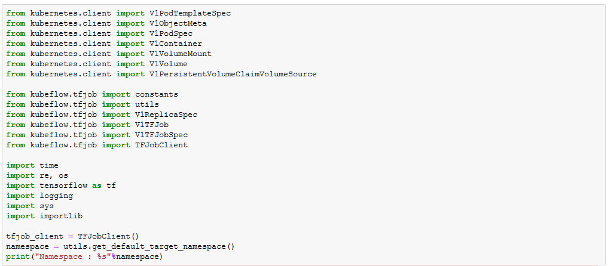
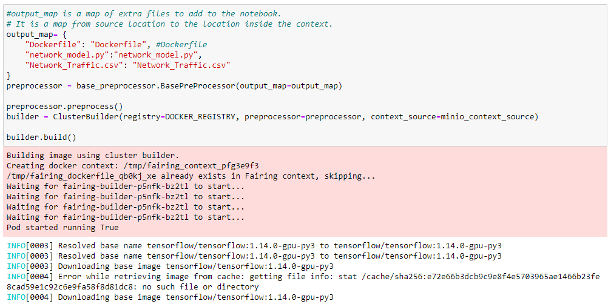
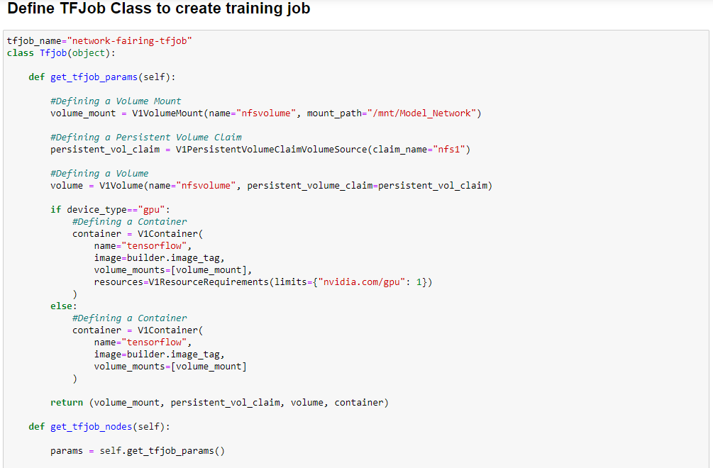
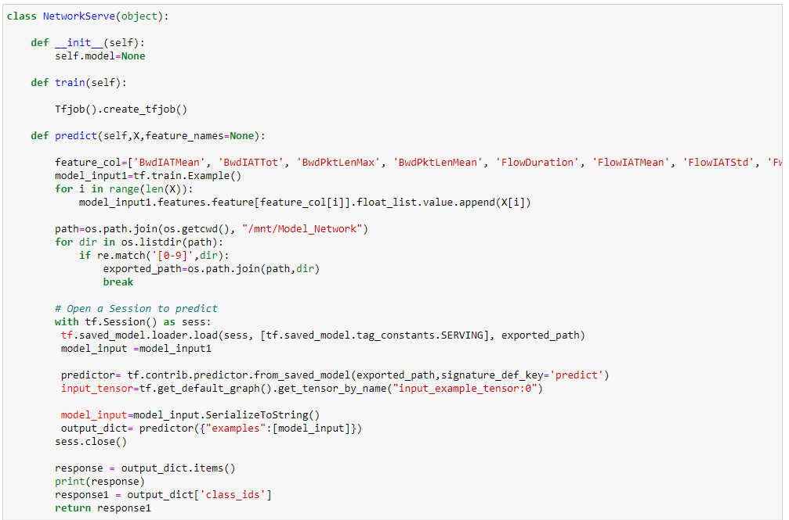
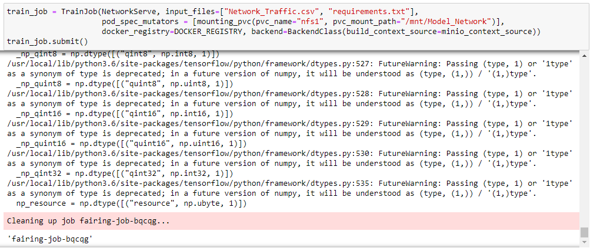
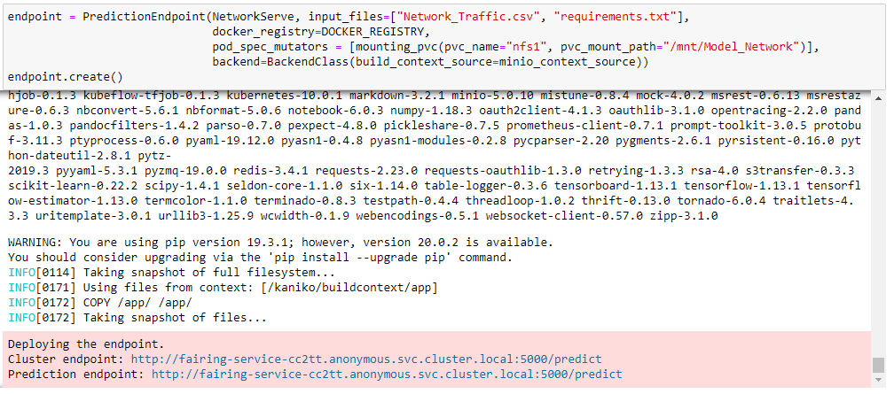
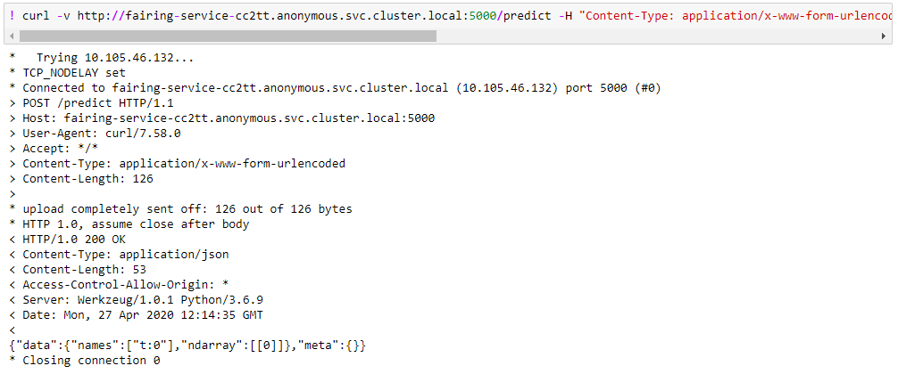

# Malicious Network Traffic Prediction using Kubeflow Fairing 

## What we're going to build

Train, save & serve a network traffic model using KF Fairing from Jupyter notebook. Then, deploy the trained model to Kubeflow for predictions.

## Infrastructure Used

* Cisco UCS - C240


## Setup


### Install NFS server (if not installed)

To install NFS server follow [steps](./../notebook#install-nfs-server-if-not-installed)

### Create Jupyter Notebook Server

Follow the [steps](./../notebook#create--connect-to-jupyter-notebook-server) to create & connect to Jupyter Notebook Server in Kubeflow

### Upload Notebook, Dockerfile and network_model files

Upload [Network-Classification-fairing.ipynb](Network-Classification-fairing.ipynb), [Dockerfile](Dockerfile) and [network_model.py](network_model.py) to notebook server.


### Run Network Traffic Notebook

Open the Network-Classification-fairing.ipynb file and run notebook


### Create requirements.txt with require python packages


### Import Fairing Packages




### Get minio-service cluster IP to upload docker build context

Note: Please change DOCKER_REGISTRY to the registry for which you've configured credentials. Built training image are pushed to this registry.


### Create config-map to map your own docker credentials from created config.json

Note: create configmap named "docker-config". If already exists, delete existing one and create new configmap.

* Delete existing configmap

```
kubectl delete configmap -n $namespace docker-config
```


### Build docker image for the model
Note: Upload dataset, Dockerfile, and network_model.py into notebook.  
Builder builds training image using input files, an output_map - a map from source location to the location inside the context, and pushes it to the registry.





 
### Define Network class to be used by Kubeflow fairing

Note: Must necessarily contain train() and predict() methods





### Train Network Traffic model on Kubeflow

Kubeflow Fairing packages the NetworkServe class, the training data, and requirements.txt as a Docker image. 
It then builds & runs the training job on Kubeflow.



### Deploy the trained model to Kubeflow for predictions




### Get prediction endpoint


### Predict Network traffic classes using prediction endpoint

Change endpoint in the curl command to previous cell output, before executing prediction cell.



### Clean up the prediction endpoint
Delete the prediction endpoint created by this notebook.


