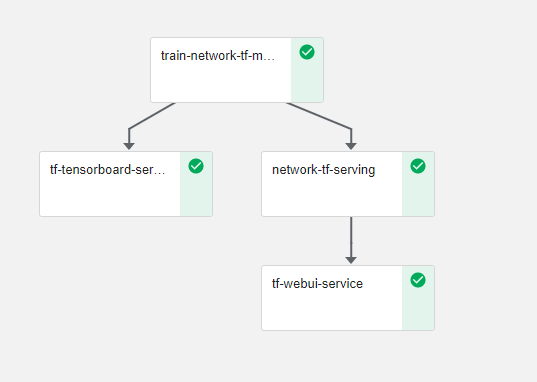

# Network Traffic Predicton using Kubeflow Pipelines

## What we're going to build

To train and serve Network Traffic model, prediction for client's request using kubeflow pipeline through jupyter-notebook.



## Infrastructure Used

* Cisco UCS - C240M5 and C480ML


## Setup

### Install NFS server (if not installed)

To install NFS server follow steps below.

#### Retrieve Ingress IP


For installation, we need to know the external IP of the 'istio-ingressgateway' service. This can be retrieved by the following steps.

```
kubectl get service -n istio-system istio-ingressgateway
```

If your service is of LoadBalancer Type, use the 'EXTERNAL-IP' of this service.  

Or else, if your service is of NodePort Type - run the following command:  

```
kubectl get nodes -o wide
```

Use either of 'EXTERNAL-IP' or 'INTERNAL-IP' of any of the nodes based on which IP is accessible in your network.  

This IP will be referred to as INGRESS_IP from here on.

#### Installing NFS server, PVs and PVCs.

Follow the [steps](../../../ble-localization/onprem/install) to install NFS server, PVs and PVCs.


### Create Jupyter Notebook Server

Follow the [steps](../../../ble-localization/onprem/notebook#create--connect-to-jupyter-notebook-server)  to create Jupyter Notebook in Kubeflow

### Upload Notebook file

Upload Network Traffic-Pipeline-Deployment.ipynb file from [here](./Network-Pipeline-Deployment.ipynb)

### Run Network Traffic Pipeline

Open the Network Traffic-Pipeline-Deployment.ipynb file and run pipeline

Clone git repo


Loading Components


Run Pipeline


Once Network Traffic Pipeline is executed Experiment and Run link will generate and displayed as output


Click on latest experiment which is created


Pipeline components execution can be viewed as below


Logs of Network Traffic Training Component


Logs of Serving Component


Logs of WebUI Component


Tensorboard Graph for Network Traffic


Predict Network Traffic using Web UI - upload data file located at [location](./../data/Network_Test_Traffic.csv)


Network Traffic Prediction with Probability


