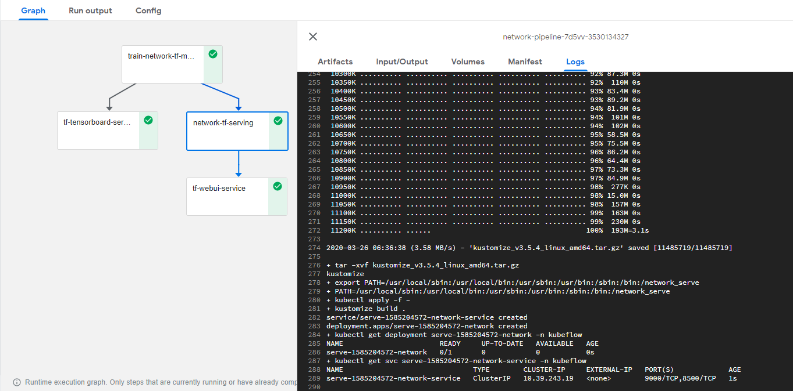
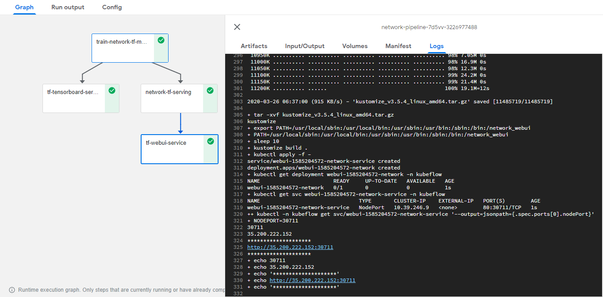

# Network Traffic location classifier using Kubeflow Pipelines

## What we're going to build

To train, serve and prodict  model  using kubeflow pipeline through jupyter-notebook.


## Infrastructure Used

Google Kubernetes Engine (Cloud)


## Setup

### Kubeflow Installation

Follow the [steps](./../../kubeflow-v1.0-installation) to install kubeflow v1.0 in GKE.


### Create secrets for github token

```
kubectl create secret generic git --from-literal=GITHUB_TOKEN=<enter your token> -n kubeflow
```

### Create Jupyter Notebook Server

Follow the [steps](./../notebook)  to create Jupyter Notebook in Kubeflow

### Upload Notebook file

Upload Network Traffic-Pipeline-Deployment.ipynb file from [here](./Network-Pipeline-Deployment.ipynb)

### Run Network Traffic Pipeline

Open the Network Traffic-Pipeline-Deployment.ipynb file and run pipeline 


Once Network Traffic Pipeline is executed Experiment and Run link will generate and displayed as output


Click on latest experiment which is created 


Pipeline components execution can be viewed as below


Logs of Network Traffic Training Component


Logs of Serving Component



Logs of Webui Component



Tensorboard Graph for Network Traffic


Predict Network Traffic Location using Web UI - upload data file located at [location](./../data/Network_Traffic.csv)


Network Traffic Prediction Location with Probability


