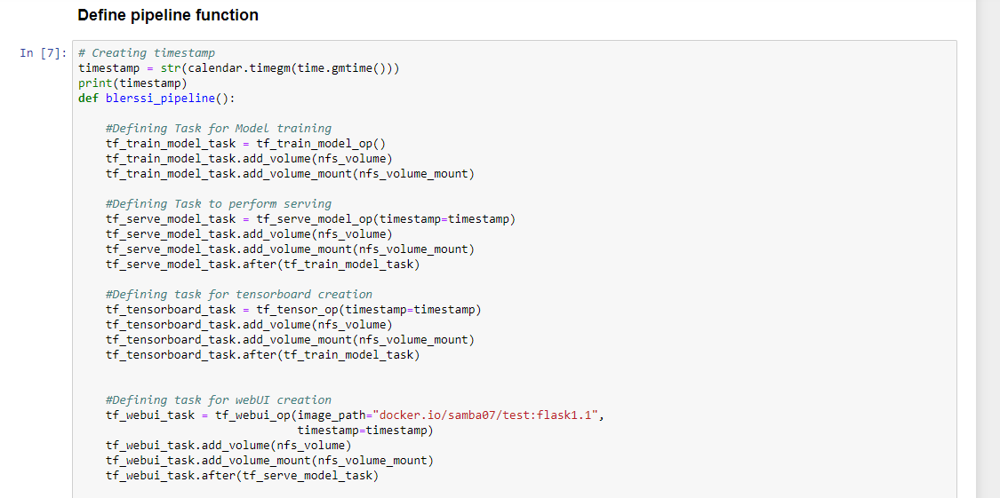
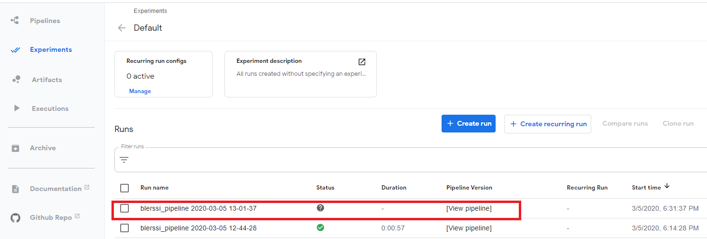
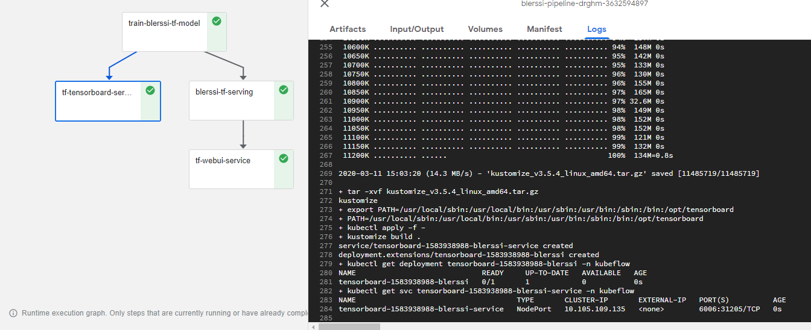
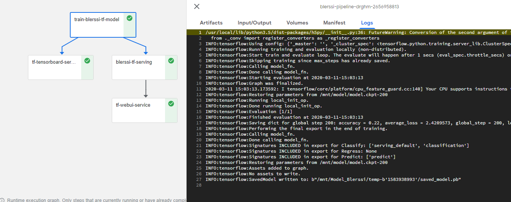
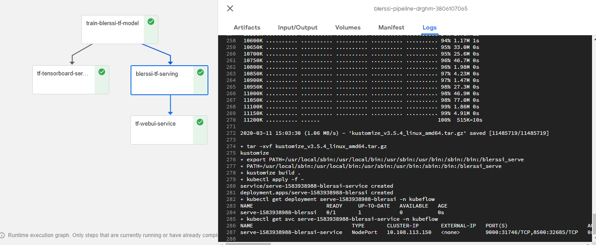
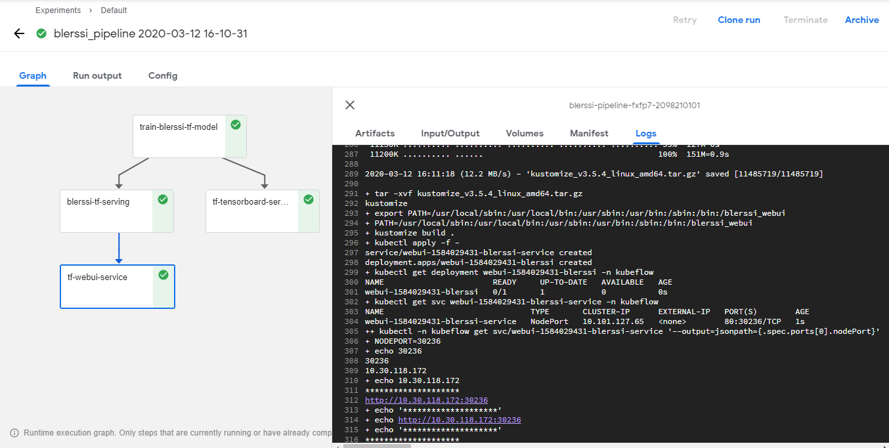
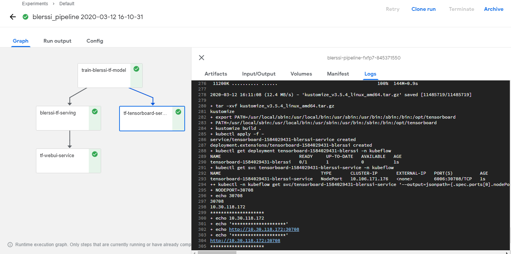
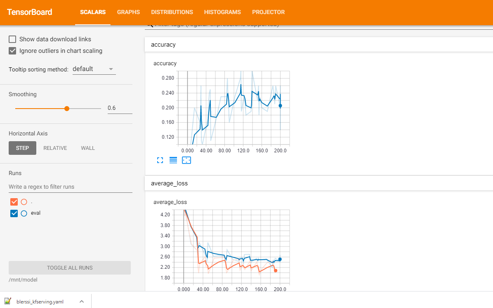
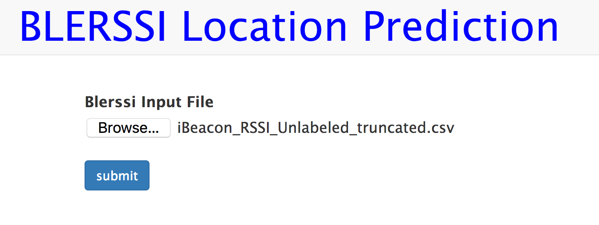
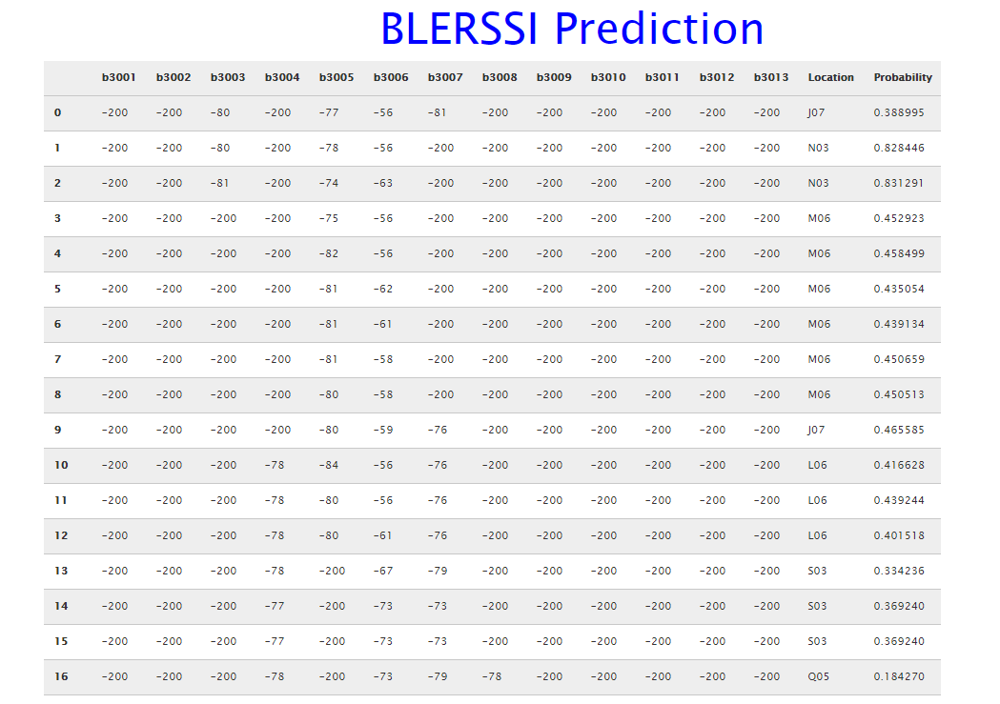

# BLERSSI Location Prediction using Kubeflow Pipelines

## What we're going to build

To train, serve and prodict  model  using kubeflow pipeline through jupyter-notebook.


## Infrastructure Used

* Cisco UCS - C240

## Setup

### Install NFS server (if not installed)

To install NFS server follow steps below.

#### Retrieve Ingress IP

For installation, we need to know the external IP of the 'istio-ingressgateway' service. This can be retrieved by the following steps.  

```
kubectl get service -n istio-system istio-ingressgateway
```

If your service is of LoadBalancer Type, use the 'EXTERNAL-IP' of this service.  

Or else, if your service is of NodePort Type - run the following command:  

```
kubectl get nodes -o wide
```

Use either of 'EXTERNAL-IP' or 'INTERNAL-IP' of any of the nodes based on which IP is accessible in your network.  

This IP will be referred to as INGRESS_IP from here on.

#### Installing NFS server, PVs and PVCs.

Follow the [steps](./../install/) to install NFS server, PVs and PVCs.

### Create Jupyter Notebook Server

Follow the [steps](./../notebook#create--connect-to-jupyter-notebook-server) to create & connect to Jupyter Notebook Server in Kubeflow

### Upload Notebook file

Upload [BLERSSI-Pipeline-Deployment.ipynb](BLERSSI-Pipeline-Deployment.ipynb)

### Run BLERSSI Pipeline

Open the BLERSSI-Pipeline-Deployment.ipynb file and run pipeline

Clone git repo


Loading Components


Run Pipeline




Once BLERSSI Pipeline is executed, Experiment and Run link will be generated and displayed as output


Click on latest experiment which is created 




Pipeline components execution can be viewed as below




Logs of BLERSSI Training Component




Logs of Serving Component




Logs of WebUI Component




Logs of Tensorboard Component



For obtaining the URLs for Tensorboard Graph and WebUI for BLERSSI as shown below, change the INGRESS_IP in the last two cells with your ingress IP.

Tensorboard Graph for BLERSSI


Tensorboard Scalar for BLERSSI




Predict BLERSSI Location using Web UI - upload data file located at [location](./../data/iBeacon_RSSI_Unlabeled_truncated.csv)




BLERSSI Prediction Location with Probability


